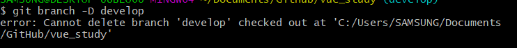

### git 브랜치 삭제 안될때
1.  삭제할 명령어 입력했는데 삭제가 안됨

	```$  git branch -d <브랜치명>```

	
2. **현재 브랜치가 삭제할 브랜치이기 때문에 삭제가 안되는 것**
3.  다른 브랜치로 전환한 뒤에
	```$ git checkout master```
4.  브랜치 삭제 명령어 다시 입력 . 브랜치 삭제 성공!
 ``` 
	$ git branch -d develop
	Deleted branch develop (was 6f11ff8).
```
