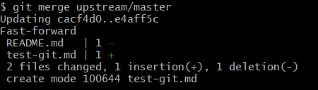

### pull request 기본 실습
- **pull request를 하기 위해 필요한 것**
	1. upstream 등록
	2. upstream 으로부터 소스코드 동기화

- **```upstream``` 은?**
	- 원본 소스코드가 있는 곳의 위치.
	- 원본저장소와 소통하기 위해 (새로운원격저장소)이름을 설정해주는 것
	- 이름은 상관없지만 upstream으로 권장함

- **``` $ git remote add upstream <원본저장소> ```** - remote 추가
	

- **```$ git remote remove upstream```** - remote 삭제
 

- **```pull request``` 과정**
	- fork한뒤 리모트 추가, 확인 (윈도우의 경우 upstream이 이미 생성되어 있음)
	- 파일 수정
	- pr요청
	- but.. 충돌이 일어나도록 파일을 수정, 추가하고 커밋했으나 충돌이 일어나지 않고 바로 병합이 됨 (일단 다음 단계로 진행하겠음)

- **오리지널 저장소 변경내역 최신화하기 ```fetch```**
	- 원본저장소에서 최신화버전도 가져올 수 있어야함
	- 과거 소스에 코드를 수정하는 불상사가 없음

- **```$ git fetch upstream```**
	- upstream내역이 변경되었는지 일단 확인. 변경내역이 없으면 아무런 변화 없음. 
	- 원본저장소 파일 추가하고 변경했을때 이러한 출력결과가 뜸
		```bash
		$ git fetch upstream
		remote: Enumerating objects: 6, done.
		remote: Counting objects: 100% (6/6), done.
		remote: Compressing objects: 100% (2/2), done.
		remote: Total 4 (delta 1), reused 4 (delta 1), pack-reused 0
		Unpacking objects: 100% (4/4), 393 bytes | 17.00 KiB/s, done.
		From https://github.com/myeongjoo2/PR-practice
		   4d786dd..e4aff5c  master     -> upstream/master
		 ```
- **```$ git merge upstream/master```**
	- 위에서 변경내역을 확인하고 가져올 차례
	- 업스트립 저장소의 마스터 브랜치를 우리의 프로젝트에 병합하겠다는 의미.
	- 병합이 완료되면 다음과 같은 메세지 출력
	
		

	- 머지가 완료되면 로컬환경에서 최신 프로젝트가 반영됨
	- 이런식으로 최신화를 완료하고 다시 새로운 작업을 진행한뒤 풀리퀘스트를 보내면 되는것

- **머지완료한뒤 꼭 커밋하고 푸시해줄것!**
	- git add 
	- git commit -m "커밋메세지"
	- git push

- **머지하고 푸시해줬을때 다음과 같은 에러 발생..**
	- permission denied이라는 에러메세지를 보니 계정을 왔다갔다하면서 push를 해서 계정오류가 생긴 것으로 추측..
	- 소스트리에서 계정인증해주고 git bash에 다시 push 해줬더니 로그인창뜨고 push 해결됨!
	- 컴퓨터 하나로 두개의 계정 사용하는 실슬을 할때 git push 하기전에 계정 확인 꼭 할 것!!!
		```bash
		Total 0 (delta 0), reused 0 (delta 0), pack-reused 0
		To https://github.com/leemyungju9347/PR-practice.git
		 ! [remote rejected] master -> master (permission denied)
		error: failed to push some refs to 'https://github.com/leemyungju9347/PR-practice.git'
		```

#### 정리
``` bash
1. 원본저장소에서 프로젝트 fork

2. fork한 원격저장소 주소를 내 로컬로 clone
	- git clone <원격저장소 주소>
	- open in desktop
	
3. $ git remote -v 
	- 명령어로 내 원격저장소 리스트 확인
	
4. $ git remote add <upstream> <원본저장소 주소>
	- upstream이라는 remote추가
	- 윈도우에 경우 clone 했을때 자동으로 upstream이라는 원본저장소가 저장이되기때문에 생략가능
	- 만약 추가했을 경우 다시한번 git remote -v 명령어로 리스트 확인해주자
	- 꼭 upstream이 아니라 다른 이름도됨 (but 이 이름을 권장함)
	- 내 원격저장소 - origin / 원본저장소 - upstream 두개씩 총 4개 있어야 함
	
5. 내 프로젝트 변경사항을 add, commit, push 
	- 해당 변경사항은 origin에 저장

6. pull request 요청
	- 내 변경사항을 원본저장소에 반영하기 위한 과정  
	- 병합 요청시 충돌이 없다면 create new pull request

(원본저장소 입장 = upstream)
7. pull request 요청을 받아줌
	- 추가로 충돌이 있을시 프로젝트 변경해주고 병합
	- 로컬에 git pull
	
8. 원본저장소의 프로젝트 내용 수정 또는 추가
9. 원본저장소 add, commit, push

(원격저장소 = 내 저장소 origin) 
원본저장소의 최신내용이 변경되었으니 내 프로젝트에도 동기화하는 과정
10. $ git fetch upstream
	- upstream 출력 결과 확인
	- 변경 내용이 있을 경우 출력 결과가 있음

11. $ git merge upstream/master
	- upstream저장소의 마스터 브랜치를 내 프로젝트에 병합하겠다는 뜻
 ```
[참고페이지](https://playinlion.tistory.com/29)


### 브랜치 생성해서 pull request 실습

**(원본저장소)**

1. 원본저장소 생성하고 master에 README.md 업로드

3. develop 브랜치 생성하고 파일 추가한뒤에 업로드

**(내 저장소)**

4. 원본저장소 fork

5. 내 로컬에 clone 
	- open in desktop으로 해줌(이게 편하다)
	- **desktop으로 clone 했으면 ```current branch```를 ```develop```으로 해주자.**
	- **이 과정을 해주지 않으면 git bash로 branch 목록을 확인했을때 develop이 없다.**

6. **```$ git remote -v```**
	- remote 설정 or 확인

7. **```$ git branch```**
	- 내 브랜치 리스트, 브랜치 위치 확인 
	- **```develop``` 에 위치**해있어야함

8. develop 위치에서 파일 업로드

9. **```$ git push origin develop```** (add, commit 해주고 해야함!!)
	- git add ,commit 해준 뒤 푸시 과정
	- **내 ```origin```에 있는 ```develop``` 브랜치에 푸시한다는 뜻!**

10. **```$ git checkout -b feature/myungju```**

	- ```develop```에서 ```feature/myungju``` 브랜치 생성

11. 새로운 파일을 추가하고 README.md 수정

12. **```$ git push origin feature/myungju```**
	- add,commit,push 과정
	- **```origin```에 있는 ```feature/myungju``` 브랜치에 commit push 한다는 뜻**

13. **변경사항을 가지고 원본저장소에 ```pull request```를 보냄.**
	- 원본저장소 ```develop``` - 원격저장소 ```feature/myungju```

**(원본저장소)**

14. **원본저장소에서 ```pull request```를 ```merge```해줌**
	- *README.md를 수정했으나 충돌없이 병합된다? 왜?*

15. **```$ git pull upstream(원본저장소 별명)```**
	- 원본저장소에서 병합했으니 변경사항을 pull해줌

16. 원본저장소에서 upstream-test.md파일을 추가하고 README.md 파일을 수정

17. 원본저장소 커밋, 푸시

**(내 저장소)**

18. **```$ git fetch upstream```**
	- 원본저장소의 업로드 여부 확인.
	- 원본저장소 프로젝트가 업로드되면 추가적인 메세지가 발생

19. **```$ git merge upstream/develop```**
	- **원본저장소(upstream)의 develop 브랜치에 병합 요청**

20. **```$ git push origin feature/myungju```**
	- git add, commit push
	- 동기화 완료!

[참고페이지](https://wayhome25.github.io/git/2017/07/08/git-first-pull-request-story/)
