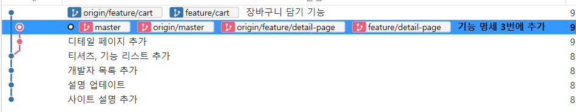
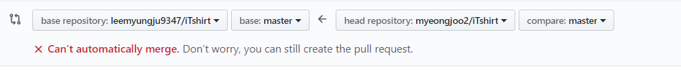

## chapter2 혼자서 Git으로 버전 관리하기
### 1. 로컬저장소를 소스트리에 불러오기
#### 로컬저장소이 정체는 [.git] 폴더
- 소스트리로 git bash창에서 명령어로 수행했던 커밋들을 볼 수 있는 것은 폴더 내부에 숨겨진 **[.git]** 폴더에 저장된 정보 덕분 이 폴더가 바로 로컬저장소
	- Cli 환경에서는 'git init' 명령어를 통해 만들어지고
	- GUI 환경에서는 [Create]아이콘을 클릭하고 폴더 선택하면 말들어짐
	- [.git] 폴더에 **버전관리한 데이터**와 이를 올릴 **원격저장소의 주소** 등 필요한 정보 저장되어 있음
### 2. 소스트리로 커밋 만들고 푸시하기
#### vscode로 파일 만들고 수정
#### 소스트리에서 파일을 선택(add)하고 커밋(commit)으로 만들기
1. 소스트리 상단의 커밋아이콘 클릭
2. 스테이지에 올라간 파일 목록에서 커밋하고 싶은 파일 오른쪽 + 클릭
	- [스테이지에 올라간 파일] 로 업데이트 되고, 이것은 ```$git add 파일명```명령어와 동일
3. 커밋을 다하고 하단에 커밋메세지 입력하면 성공
4.  좌측 history에서 확인

#### 커밋을 원격저장소에 푸시하기


 
- **[master]는 로컬저장소 버전**
- **[origin/master]는 원격저장소 버전**
- 내컴퓨터의 로컬저장소의 버전은 '티셔츠,기능 리스트 추가'인데 원격저장소의 버전은 하나 이전의 버전인 '개발자 목록 추가' 상태라는 것
- origin :  우리가 연결한 GitHub 원격저장소의 닉네임
	 ```$ git remote add origin https://github.com/leemyungju9347/iTshirt.git```
	**origin 이란 이름으로 원격저장소를 추가하라는 뜻**
-  만약 ```$ git remote add myOrigin ....```이라고 했다면? 소스트리에서는 [origin]이 아닌 [myOrigin] 이라고 보일것
- 정리하자면 **[origin] 꼬리표는 원격저장소의 현재 버전상태를 가리키는 커밋에 붙어 있다고 할 수 있다**
- master : **줄기** 
	- 따로 줄기를 생성하지 않으면 Git은 master라는 기본 줄기에 커밋을 올림
- 아무것도 붙지 않은 [master]는 내 컴퓨터 로컬저장소의 버전을
- **[origin/master]는 GitHub 원격저장소의 버전을 가리키는 것!**
- 따라서 위의 그래프를 다시 해석해보면 로컬저장소의 버전과 원격저장소 버전의상태가 다르다는 것
- push 아이콘 -> master 체크 이 명령은 현재 줄기인 master의 모든 새로운 커밋을 원격저장소에 올리겠다는것
	
- 
	
	로컬저장소의 [master]와 원격저장소의 [origin/master] 모두 최신 커밋을 가리키고 있는 것을 확인.
### 3. 그림으로 Git 뜯어보기
#### 커밋은 Delta(차이점)가 아니라 Snapshot(스냅사진)
- git의 가장 큰 특징 커밋에 바뀐 것만 저장하는 것이 아니라 전체 코드를 저장한다는것
- 바뀌지 않은 파일은 이전 파일의 링크만 저장하기 때문에 용량도 적고 계산할 필요 x -> 이런 특징은 앞으로 배울 여러 복잡한 명령어들을 빠르게 처리할 수 있음
- 소스트리에서 커밋을 선택했을때 기존 커밋과의 차이점만 보이는 이유는 Git이 자동으로 앞뒤 커밋의 차이점을 계산해서 보여주기 때문
- Git으로 관리하는 파일의 4가지 상태
	- Git이 파일을 어떻게 추적하고 스테이지에 올리는지 확인
		untracked -> tracked (수정없음 - 수정함 - 스테이지됨)
		- Git으로 관리하는 파일은 총 네가지 상태를 가지게 된다. 각 파일이 이 네가지 상태를 오고가며 버전 관리를 하는 것이다. 
## chapter 3 여러명이 함께 Git으로 협업하기
### 1. 원격 저장소에서 협업하기 : 브랜치(Branch)
#### Git이 커밋을 관리하는 방식 : 줄줄이 기차
- 두명 이상이 협엽할 경우 특정 기준에서 줄기를 나누어 작업할 수 있는 기능인 브랜치로 협업
- 새로운 가지로 커밋을 만들려면 반드시 브랜치를 먼저 만들어야함
- 브랜치로 만들지 않고 협업한다면 오류 발생
		- 원격저장소에 먼저 푸시한 커밋은 정상적으로 올라가고 뒤늦게 푸시한 다른 커밋은 '너는 낡은 코드에 푸시를 하는 것이다. 최신 코드에 푸시하라'는 오류가 난다.
#### 브랜치 정체를 밝혀라
- master 는 Git이 제공하는 기본적인 브랜치. 첫 커밋시 자동으로 'master'라는 브랜치가 커밋을 가리킴
- 두번째 커밋시에는 master브랜치가 두번째 커밋을 가리킴
- [master]브랜치에 커밋을 '올린다'가 아니라 '가리킨다'라고 표현할까? 
	- 브랜치가 길이 존재해서 그 길에 올리는 것이 아니라 단순한 **pointer**이기 때문 
		- 컴퓨터의 마우스 커서(포인터)를 생각하면 됨
	- **순서대로 커밋1,커밋2,커밋3을 만들었다고 하면 커밋할때마다 [master] 브랜치의 포인터가 최신커밋을 가리킴**
	- 새로운 브랜치 생성
		- 예를들어 세번째 커밋에 고양이 브랜치를 생성했다고 하면,
			- [master] 브랜치와 동일하게 커밋3를 가리킬 것이다.
			- 현재 [고양이 브랜치]와 [마스터 브랜치]의 상태는 모두 커밋3
		- 브랜치가 포인터라는 것은 그저 커밋을 가리키는 것만으로도 분기를 만들 수 있다는 장점
		- 만약 고양이 브랜치에서 커밋을 하나 더 시도했을때? -> **[master] 브랜치보다 커밋 하나만큼 앞서게 된다**
		- 그상태에서 [master] 브랜치로 이동해 커밋을 하나 더 하면?
			- 이제는 [고양이]브랜치 와 [master] 브랜치의 버전이 눈에 띄게 갈라지게 됨
			- **커밋3를 기준으로 두가지 버전이 생기게 되는것!**
		- **그럼 내 컴퓨터에서 [고양이] 브랜치와 [master] 브랜치 사이를 넘나들 수 있는 방법은? [HEAD]라는 특수한 포인터**
			- **브랜치 혹은 커밋을 가리키는 포인터 [Head]를 이용해 브랜치 사이를 타임머신 처럼 마음대로 넘나들 수 있다.**
			- 만약 [HEAD]를 과거의 커밋을 가리키게 한다면? **이 경우에는 [master] 브랜치의 포인터와 [HEAD]가 떨어져있기에 '분리된 HEAD(Deatached HEAD)' 상태가 된다.**

### 2. 브랜치 실습 기본 : 만들고, 이동한다
#### 새 브랜치 만들기
- detail-page 이름의 브랜치 생성 ([master] 브랜치의 최신 커밋 기준)
- 여러 사람이 작업하는 원격저장소에서는 미리 브랜치 규칙을 정해줘야함
	- 고양이와 문어가 [master] 브랜치에는 직접 커밋을 올리지 않기로 함, 각자 [feature/] 브랜치를 만들어 개발이 완료되면 병합하기로 함
	- 아래 네가지 규칙으로 브랜치를 작성
		```
		1. [master] 브랜치에는 직접 커밋을 올리지 않는다 ( 동시에 작업하다 꼬일 수 있으니
		2. 기능 개발을 하기 전에 [master] 브랜치를 기준으로 새로운 브랜치를 만든다.
		3. 이 브랜치 이름은 [feature/기능이름] 형식으로 하고 한 명만 커밋을 올린다. 
		4. [feature/기능이름] 브랜치에서 기능 개발 끝나면 [master] 브랜치에 이를 합친다.
		```
		- **각자 작업할 'feature/기능이름' 의 브랜치를 만들고, 작업이 완료되면 이를 [master] 브랜치에 각자 합치려는 계획**
- 브랜치 생성 과정
	1.	소스트리에서 브랜치 생성
		- 체크아웃은 브랜치를 이동하는 명령어  그래서 [ 새 브랜치 체크아웃] 체크박스를 선택하면 브랜치를 만듦과 동시에 그 브랜치로 이동하게 된다. ( 체크를 해제하면 브랜치는 만들어졌지만  [HEAD]는 여전히 [master] 브랜치를 가리킨다.
	2.  브랜치가 생성되고 '티셔츠, 기능리스트 추가' 커밋을 가리키는 것을 확인
		
	
		
		- (좌측에서 확인)브랜치 이름에 '/' 를 넣으면 앞에 적은 텍스트 'feature'가 마치 폴더처럼 구분되어 보여짐 (소스트리의 편의 기능)
	4.  디테일 페이지 파일을 추가하고 커밋 시도
		
		
			
	5. feature-list.md파일 마지막 라인에 텍스트 추가 ( 다른 사람과 협업시 똑같은 코드를 고치는 상황에 예시가 되니 기억할것!)
	6. 소스트리에서 커밋하고 커밋메세지 아래 [-에 바뀐 내용 즉시 푸시] 체크하고 커밋 
			- 현재 브랜치인 [feature/detail-page]에 푸시까지 한번에 가능
	7. 내용을 추가하고 커밋이 생성
		
	
		
		- [origin/feature/detail-page] 브랜치 꼬리표도 붙음 
		- [origin/]이 붙을 것으로 봐서 원격저장소에 올라간 것을 확인
	8. GitHub원격저장소 [Branch:master] 드롭다운 버튼을 클릭하고 브랜치 올라온 것을 확인.
#### 브랜치 이동하기 : 체크아웃(chekout)
- 장바구니 기능 만들기 (문어개발자ver)
- **[master]브랜치로 돌아가서 새로운 브랜치 생성**
	- **만약 [master]브랜치로 이동하지 않고 [feature/detail-page]에 남아서 브랜치를 만들면 고양이(다른협업자)의 수정본까지 모두 반영되는 불상사가 생기니 주의할 것**
	- **브랜치를 만들때는 base브랜치를 잘 설정해야 한다!!**
	- 브랜치 이동명령 **체크아웃** 사용
	- 문어개발자 브랜치 생성 과정
		1. 소스트리 좌측 탭에서 체크아웃하려는 브랜치에서 [체크아웃master]클릭
		2. '티셔츠, 기능 리스트 추가'로 돌아옴 [master]브랜치로 체크아웃 된 것 (좌측 브랜치에서 글씨가 굵게 보이면 현재 위치임)
		3. 현재 위치가 [master]위치인 것을 잘 확인하고 브랜치 생성  
		4. **[iTshirt-cat] 폴더에 있는 feature-list파일을 확인해보면 고양이 개발자 브랜치에서 추가했던 3번 디테일 페이지 보여주기 텍스트가 없는 것을 확인**
			- **텍스트를 추가하기 이전의 버전으로 왔으니 당연한 결과**
		5. 위의 사실을 모르고 마지막 라인에 3번 장바구니 담기를 추가 
			- **나중에 합칠때 둘이 충돌을 어떻게 해결할지 확인!**
		6.  추가로 cart.md 파일을 만들고 장바구니 담기를 입력하고 저장
		7.  커밋하고 푸시까지 같이 해줌
			- 노란색파일 : 수정한 파일 , 초록색 : 새로추가한 파일
		8.  히스토리 그래프 확인
			- [master] 브랜치 ('티셔츠,기능 리스트 추가') 커밋을 베이스로 detail-page브랜치커밋, cart브랜치커밋 두가지가 뻗어 나옴
      
				
        
		- 개발이 완료되면 [master]브랜치에 내 브랜치 작업물을 합치면 되는 것
			- [master]브랜치를 기준으로 만든 브랜치니 [master]브랜치를 큰 줄기로 잡고 잔가지에서 조금씩 수정해서 다시 큰 줄기에 합치는 것.
			
### 3. 브랜치와 브랜치를 합치기 : 병합(merge, 머지)
#### 병합이란?
- 병합은 두버전의 합집합을 구하는 것
- **Marge commit ( 병합 커밋 )**
	- 커밋을 병합해 새로운 커밋인 '병합 커밋'이 생기는 것
- **Fast-forward (빨리 감기 )**
		- 앞 커밋 뒷커밋을 합치면 뒷커밋과 동일함
		- 새로 상태를 만들어 줄 필요 없이 뒷 문어로 상태를 바꿔주는 것
- **Conflict (충돌)**
	- 커밋이 겹치는 것 
	- 충돌이 난 부분만 확인하고 무엇을 남길지 수동으로 선택해주면 됨 
#### 두 브랜치를 합치는 과정
- **merge(머지)**
	- 브랜치와 브랜치를 합치는 명령어
		- 병합
		- 고양이와 문어는 각각 개발을 완료했기 때문에 각자 만든 두개의 브랜치를 **[master]브랜치에 합쳐야함**
		
#### 브랜치 합치기 실습 : 빨리 감기 병합
- [master] 브랜치를 기준으로 [feature/detail-page] 브랜치를 합칠 것
- 빨리감기 병합 과정
	1. 소스트리에서 [master] 브랜치로 체크아웃
	2. 병합을 원하는 커밋에서 마우스오른쪽을 눌러 [병합] 메뉴 선택 
		- [feature/detail-page] 브랜치의 최신 커밋 선택
	3. 브랜치 병합 팝업창 확인
		- fast-forword가 가능해도 새 커밋으로 생성 체크박스를 선택하면 명시적으로 병합커밋을 만듦 지금은 체크x
	4.  두 브랜치가 합쳐짐
		
	 
		
	5. push 해줌 origin/master모드 커밋을 가리킴
		
		

### 4. 충돌 해결하기
#### 브랜치 합치기 실습 : 병합 커밋 및 충돌 해결
- [feature] 브랜치를 기준으로 병합
- 커밋3과 커밋4는 서로 다른 분기에 있어서 병합 커밋을 만들면서 코드를 합쳐야함
- [master]브랜치에 바로 병합하지 않고 나만 쓰는 [feature/cart]브랜치에서 먼저 병합해보고 문제가 없는지 확인한다.
- 병합된 커밋이 문제가 없는 것을 확인하고 나서 병합 커밋 [master]브랜치에 반영

### 5. 브랜치를 합치는 예의바른 방법 : 풀 리퀘스트
- 풀리퀘스트는 협력자에게 브랜치 병합을 요청하는 메세지를 보내는 것 
#### 풀 리퀘스트 만들기
- **무조건 풀 리퀘스트를 보내고 서로가 [승인]버튼을 눌렀을때만 병합을 하자**는 구체적인 협업 계획을 세움
1. 댓글 기능 제작을 위해 comment 브랜치 생성 (현재 브랜치가 [master]브랜치인지 꼭 확인)
2. 브랜치 생성후 comment 파일 생성해서 작성하고 push해줌
3. 원격저장소를 확인해보면 노란색 음영으로 방금 내가 푸시한 [feature/comment]브랜치를 알려줌. 옆에 풀리퀘스트버튼 클릭
4. 풀리퀘스트 버튼을 누르면 정중하게 병합을 요청할 수 있는 메세지를 적을 수 있는 페이지가 나옴
	- 먼저 베이스브랜치와 비교 브랜치 설정
	- 3절에서 병합할때 병합한 결과물을 두 브랜치 중 어느곳에 올려야 하느지 정해야 한다고 했음
		- [base:master],[compare:feature/comment]로 설정
5. 풀리퀘스트가 등록됨 이제 원격저장소의 협력자(문어)가 이 풀 리퀘스트를 확인하고 새롭게 추가된 코드를 검토 할 수 있음
	- 코드 라인마다 댓글 기능이 있어서 토론 진행도 가능
	-협력자는 수락할수도 있고(Accept), 수정을 요청할 수도 있고(Request change), 병합할 수도 있다.
6. 별 이상이 없는 것을 확인하고 병합한다고 하고 [Merge pull request] 버튼을 클릭한다.
7. 완료되면 pullrequest closed에서 확인할 수 있음
8. 소스트리에서 병합 커밋 생성한 내역이 없다면 패치해줌
	- pull 이 실제 코드를 내려 받는데 비해 패치는 그래프만 업데이트 함 
	- 소스트리는 10분에 한번씩 자동 패치 그래프가 매반 새로워보임
9. 병합된 것을 확인하고 master에서 체크아웃
10. pull 해줌

### 6. 개발이 완료되었습니다. 출시하자! : 릴리즈 (release)
#### 프로그램 버전이란?
- 프로그램 출시할때 , 업그레이드 시 만든 회사는 버전을 명시
- 버전을 올리는 것은 크게 메이저 업그레이드와 마이너 업그레이드로 나뉨
	- 사용자들이 크게 느낄 변화 적용시 -> (보통) 메이저 (v.2.x->v.3.x)
	- 작은 변화등이 생겼을때 -> 마이너 버전 (v.2.3 -> v.2.4)
	- node.js 를 예로 들면, 10.15.0 LTS 과 11.6.0 버전 제공
		- 가장 최신 버전은 11.6.0이지만 안정적인 버전은 10.15.0
		- 10.15.0 뒤에 붙은 LTS는 '장기 지원 버전'의 약자인데 일반적인 버전보다 장기간에 걸쳐 지원하도록 특별히 만들어진 버전
		- 10.15.0 버전명을 보면 메이저 버전인 10,마이너버전인 5, 뒤에서 세번째 버전이 있음을 볼 수 있다. 
		- 이는 메인터넌스 버전으로 버그나 유지보수 등 작은 수정이 들어갔을때 바꾼다.
#### 특정 커밋에 포스트잇 붙이기 - 태그(tag)
- 프로그램을 출시하는 것을 **릴리즈**라고 함
- 병합을 마친 [master]브랜치를 배포하고 현재 코드 상태를 버전 v1.0.0 이라고 기록하려고 함
- 태그로 간단하게 표시, 브랜치는 특정 커밋을 가리키는 포인터라고 했는데 태그도 그런 개념
- 방법
	1. [master]브랜치에 있는 상태에서 소스트리 상단의 [태그] 아이콘을 클릭, 태그이름 v1.0.0적고 추가
	2. [master]브랜치 라벨 옆에 [v1.0.0]라벨이 새로 붙은 것을 확인
	3. 태그도 푸시해줘야 원격저장소에서 볼 수 있음 ->  푸쉬해줌
	4. 원격저장소에서 [1 release] 탭을 클릭하면 방금 만든 버전 태그가 존재
	5. [zip]아이콘을 누르면 해당 태그가 가리키는 버전을 압출파일로 받을 수 있음

## chapter4 둘 이상의 원격저장소로 협업하기

### 1. 원격저장소를 복사해서 너구리의 원격저장소를 만든다(fork)
```
fork
- 제 3자 너구리는 고양이,문어가 만든 [iTshirt] 원본저장소에 바로 커밋을 올릴 권한이 없음
- 따라서 [iTshirt] 원본저장소를 복사해서 본인의 새로운 원격저장소를 만들고 이곳에서 커밋해야함
- 새로운 원격저장소는 너구리만 사용하는 곳이므로 온갖 실험적인 커밋을 올릴 수 있음
```
- 이렇게 남의 원본저장소를 내 계정의 원격저장소로 복사해오는 명령어는 포크이다.

#### 평행세계를 만드는 브랜치 (branch), 평행우주를 만드는 포크(fork)
- 기본적으로 원본저장소에 커밋을 직접 푸시할 수 있는 사람은 원본저장소를 만든 본인(소유자)뿐
- 다른 사람이 이곳에 푸시하려면 원본저장소의 소유자가 이사람을 협력자로 등록해야함, 등록되지 않은 사람이 이곳에 푸시를 하면 에러 발생
	- 원본저장소의 소유자가 협력자로 등록하는 방법
		- 메뉴 [Settings - Collaborators] 페이지 - > 등록 유저 찾기
		- [Add collaborator] 클릭
		- 협력자의 계정으로 초대 이메일이 옴, 협력자가 수락 버튼을 눌러야 권한이 완전이 부여됨
- 원본저장소의 소유자입장에서 협력자가 늘어날수록 원본저장소 관리가 어려워짐 -> 협력자가 원본저장소에 push할 수 있기때문
	- 원본저장소 - 많은 개발자들에게 의견을 받고 오픈 소스를 개선하고 싶음 vs 개발자도 오픈소스에 참여하고 기여받고 싶음 (but 직접 push는 부담)
- 이럴때의 대안으로 쓰는 방법 **풀 리퀘스트 (pull request)**
	 ```
		1. 개발자는 원본저장소를 자신의 계정으로 복사(fork)해서 원격저장소를 생성
		2. 이곳에 커밋을 올린 후 원본저장소의 소유자에게 병합을 요청
		3. 원본저장소의 소유자는 개발자의 병합 요청을 검토한뒤 원본저장소에 반영
	``` 
	- 브랜치를 통해 코드 분기점을 만들고 풀 리퀘스트를 통해 서로 확인하고 병합하는과정이랑 동일한 과정
	- **but 다만 fork한 원격저장소의 브랜치에서 원본저장소의 브랜치로 풀 리퀘스트를 보내는 것**
- 브랜치 - 원본저장소 내 평행세계 vs 포크 : 평행우주 (비유)
	- 포크는 브랜치를 포함한 원본저장소의 모든 커밋이력은 새로운 원격저장소로 통째로 복사하는 것 
	- 브랜치에 올린 커밋 이력은 원본저장소에서 바로 볼 수 있는 것에 반해 복제한 원격저장소(평행우주)는 새로운 주소로 독립되었기 때문에 이곳의 이력을 보려면 추가적으로 이곳의 원격저장소 주소를 등록해야함
- 코드를 협업하기 위한 분기점을 나누는 방법 ( 프로젝트 특성에 맞게 선택 - 2가지)
	1. **5 명 정도 되는 적은 수의 개발자와 협업을 한다면 모두 협력자로 등록하고 브랜치를 나누어서 작업하는 것이 효율적**
		- 서로의 작업을 간편하게 한 곳의 프로젝트 이력에서 볼 수 있음
	2.  **50 명 혹은 그 이상의 개발자가 한 곳에서 작업을 해야한다면 ?**
	

	|종류|의의|편리한점|불편한점|
	|-------|---|---|---|
	|브랜치|하나의 원본저장소에서 분기를 나눈다.|하나의 원본저장소에서 코드 커밋 이력을 편하게 볼 수 있다.|다수의 사용자가 다수의 브랜치를 만들면 관리하기 힘들다.|
	|포크|여러 원격저장소를 만들어 분기를 나눈다.|원본저장소에 영향을 미치지 않으므로 원격저장소에서 마음껏 코드를 수정할 수 있다. |원본저장소의 이력을 보려면 따로 주소를 추가해야 한다.|

#### 남의 저장소를 내 계정에 통째로 복제하기(Fork)
1. 새로운 계정 생성
2. [iTshirt] 원본 저장소로 이동
3. 우측 상단에 fork 버튼 클릭
4. 포크가 끝나면 이름 밑에 원본저장소 출처가 나오고, 마음대로 커밋을 올리거나 브랜치를 만들 수 있음.
5. 포크되어 새롭게 만들어진 너구리 원격저장소를 소스트리로 내컴퓨터에 받아오는 과정 - 너구리 원격저장소 주소 복사
6. 소스트리에서 주소 클론 ( 프로그래밍폴더 -> [iTshirt-raccoon]생성 -> 경로 선택 ->클론)
7. 라쿤 소스트리에는 3장에서 만들었던 커밋 히스토리가 다 보임
8. 너구리계정 소스트리 새 로그인하기
	- 너구리 계정 등록
	- 계정 초기화
9. vscode에서 like.md 파일 생성, 저장
10. 소스트리 커밋페이지 하단에서 계정이 너구리인지 확인, 아니라면 '대체 작성자정보 사용'에서 너구리 계정 정보 추가
11. 커밋, 푸시 

### 2. 원본저장소에 풀 리퀘스트 보내기
- 너구리가 포크한 내용과 커밋을 원본 저장소에 반영하기

#### 포크한 원격저장소에서 원본저장소로 풀 리퀘스트 보내기
- 풀 리퀘스트 
	- 'A브랜치에 B브랜치를 합치려고 하는데, 새로 추가된 코드는 다음과 같다.' 라는 메세지를 보내는 것 (= 포크한 원격저장소에서 원본저장소로 코드를 합치는 과정)
- 포크한 원격저장소의 A 브랜치에서 원본저장소의 B브랜치로 코드를 합치는 것?
1. github 너구리 계정에서 commit한 like.md확인
2. 확인했으면 이제 **이 변경사항을 고양이와 문어의 원본저장소에 알려주고 병합 요청을 보낼 차례** -> [New pull request] 버튼 클릭
3. [head repository]에 내가 포크한 원격저장소, [base repository] 원본저장소
	- 화살표방향 : **head 의 변경사항을 base에 합치려 한다는 것!**
	- **'Able to merge' : 충돌없이 바로 병합 가능**
4. 모든 정보가 확실하면 [Create pull request] 버튼
	- **누르기전 반드시 아래의 변경파일(changed files) 정보를 꼼꼼하게 확인!!**
5. 풀 리퀘스트에 대한 설명 (디자인이나 UI변경이 일어났다면 스크린샷을 찍어 첨부) , [create pull request]
	- 참고) 컨트리뷰션 가이드라인
		- 오픈소스에 풀 리퀘스트를 보내기전 '컨트리뷰션 가이드라인'이 있는지 확인
		- 보통 원본저장소 README.md 파일에 링크되어 있음 
		- 이파일에는 컨트리뷰터가 풀 리퀘스트를 보낼때 미리 확인하면 좋은 것 등이 기재되어 있음
6. 성공

	


7.  원작자의( 고양이,문어) 승인과 병합 차례(아래참고)

#### 풀 리퀘스트를 승인하고, 병합하기
1. 너구리 로그아웃 다시 고양이 계정 로그인
2.  로그인하고 [iTshirt]로 가서 누가 포크했는지 확인
	- 원본저장소의 [Insights]탭 클릭
	- 왼쪽 [Forks]클릭
3. [pull requests] 탭에서 풀 리퀘스트 들어온 것 확인, 내용확인
	- [File changed] 탭을 클릭하면 어떤 새로운 코드가 풀 리퀘스트에 담겨 있는지 확인
	- 변경된 코드 왼쪽 [+] 플러스 버튼에서 코드 라인별로 댓글 달 수 있음 여기에 수정사항을 제안하거나 질문
	- 코드 리뷰를 끝내고 우측 상당의 [Review changes]을 클릭하면 [Write]창이 열림
	- 댓글만 달고 싶다면 [Comment]
	- 댓글달고 바로 병합해도 될 것 같으면 [Approve]선택하고 [Submit review]
4. 승인을 했으니 이제 병합
	- [Merge pull request] 버튼을 눌러 풀 리퀘스트를 병합
	- **이것은 원본저장소 주인만 할 수 있음 너구리는 할 수 없음!**
5. 완료되면 아래 커밋메세지가 뜸

	
	
6. 원본저장소에 너구리 코드 병합 확인!

	
	
7. [Insights] -> **[Contributors]에 가보면 너구리도 원본저장소의 컨트리뷰터에 포함된 것을 확인!!**

	

8. 너구리 계정에서 오픈소스를 자랑하기
	- 로그아웃, 너구리계정 로그인
	- [Your profile]
	- [Customize your pins] 텍스트
	- 내 프로필 첫페이지에 노출되는 원본저장소 목록 지정 

### 3. 묵은 커밋을 새 커밋으로 이력 조작하기 (rebase)
너구리 새로운 코드 만듦 -> 풀리퀘스트 보냈더니 충돌-> 배운내용처럼 내 브랜치로 먼저 병합하고 충돌 해결한뒤 다시 풀 리퀘스트 -> but 풀리퀘스트에 내가 추가한 코드 이외에도 충돌을 해결하느라 생긴 병합 커밋 생김 -> 깔끔하게 변경부분만 풀리퀘스트 보내는 방법 알아보기

#### 원격저장소에 새로운 커밋이 있는데, 포크한 내 원격저장소에는 안보여요!
- 먼저 원본저장소와 너구리의 원격저장소가 서로 같은 코드를 고쳐서 병합할때 충돌이 나는 상황을 만들자
1. 너구리가 코드 수정
	- like.md 파일 2번라인에 '찜하기 기능' 저장
2. 소스트리 너구리 계정에서 커밋, 푸쉬
3. 소스트리 [iTshirt-cat]탭으로 이도으 [master]브랜치 커밋 이후 2개의 커밋 추가된 것을 확인
	- 2절에서 너구리가 '좋아요 기능 추가' 커밋을 너구리의 원격저장소에서 고양이의 원본저장소로 풀 리퀘스트를 보냄
	- 고양이가 이를 승인해서 원본저장소에 반영
	- but 소스트리 [iTshirt-cat]탭에서는 원본저장소의 최신 업데이트를 받아오지 않아서 2개의 커밋이 반영되지 않은 것 (로컬저장소에 반영되지 x)
	- 현재는 [iTshirt-cat]로컬저장소이므로 너구리가 방금 추가한 '찜하기 기능 추가' 커밋은 보이지 x
4. 커밋을 로컬저장소로 받아오기
	- **좌측 사이드바에서 [master] 브랜치 오른쪽 마우스 -> [가져오기 origin/master(추척됨)선택**
	- **원본저장소에서 pull을 받아오는 것**
5. 충돌이 나는 상황 만들기
	- 커밋 2개 추가
	- 소스트리는 고양이 계정으로 변경
6. vscode에서 like.md 2번 라인에 '싫어요 기능' 추가
	- 너구리 로컬저장소에 있는 like.md 파일과 다름
	- 이제 너구리가 풀리퀘스트를 보내면 충돌이 발생할 것
7.  소스트리 고양이 탭에서 like.md 커밋,푸시
8. 새롭게 [iTshirt-cat] README.txt에서 개발자 목록에 너구리 추가
9. 너구리 원격저장소에서 원본저장소에 풀 리퀘스트 요청
	-  코드가 충돌이 났다는 메세지가 뜸
	
		
	
	- **너구리 저장소에서 [New pull request] 버튼을 눌렀는데 왜 상단엔 고양이 저장소가 보일까?**
		- 포크한 저장소 (너구리) 에서 [New pull request]버튼을 클릭하여 원본저장소(고양이)로 풀 리퀘스트를 보내는 것이 성공하면 원본저장소(고양이)로 페이지가 자동으로 이동한다. 풀 리퀘스트는 모두 원본저장소에 쌓이기 때문에 자연스러운 페이지 이동이라고 생각하면 된다.

#### 여러 원격저장소 히스토리 한 눈에 보기: 리모트 추가(Add remote)
- 포크한 이후로는 원본저장소에 무슨일이 일어났는지 너구리는 모름
-  원본저장소와 포크한 원격저장소는 이미 서로 다른 원격저장소이기때문
- **내 원격저장소에서 다른 원본저장소의 히스토리도 함께 보고싶다면?**
	- **소스트리가 원본저장소와 원격저장소를 동시에 추적하도록 만들면 됨**
	- **하나의 로컬저장소에서 두개 이상의 원격저장소를 바라보는 방법**
1. 소스트리 너구리로 설정 초기화
2. 소스트리 너구리 탭으로 이동
3. [저장소] - [원격저장소 추가] 클릭 
	- 너구리 개발자는 [너구리/iTshirt] 원격저장소만 origin 이라는 이름으로 바라보고 있었으니
	- 이제 [고양이/iTshirt] 주소를 다른 이름으로 추가하는 것
	- [원격]섹션을 보면 [origin]만 있음
4. 들어가면 내컴퓨터의 [너구리/iTshirt] 로컬저장소와 연결된 원격저장소 경로가 보임
	- 새롭게 추적하고 싶은 고양이의 저장소는 새로운 이름으로 저장
	- 좌측 [추가] 버튼 클릭
5. 원격이름 upstream  (원본저장소를 지칭하는 관용적 닉네임), URL/경로에는 원본저장소 주소 
6. 왼쪽 사이드바의 [원격] 섹션에 [origin]말고도 [upstream] 추가, but 아무 변화 x

	

7. [upstream에서 가져오기] 메뉴 선택
	- **[upstream]원본저장소에 있는 히스토리를 받아오는 것 이것을 패치라고 함**
	- **패치란 '새로고침'기능 패치를 하면 원본저장소 이력을 업데이트한다**
		- but 이력만 가져오는거기 떄문에 내 코드에는 영향x
		- 최신코드를 내코드에 반영하는 pull과 다름\
8. [원격] 섹션에서 [upstream] 아래에 이력이 추가됨,[upstream/master]라는 브랜치에 머지커밋과 새로운 커밋이 추가됨
	- 그래프를 보면 [origin/master]에는 포크한 너구리 원격저장소의 코드가,
	- [upstream/master]에는 고양이와 문어의 원본저장소 코드가 있음

#### 묵은 커밋을 방금 한 커밋처럼: 리베이스(Rebase)
- 너구리가 너무 예전 코드를 기점으로 새 코드를 추가, 이렇게하면 원본저장소의 최신코드와 충돌 가능성 up
- 풀리퀘스트 보냈을때 충돌이 난다면?
	- 현재 커밋과 병합하고 싶은 커밋을 미리 내 브랜치에서 병합해서 병합 커밋을 만들고 이를 풀 리퀘스트로 보내는 방법


		


