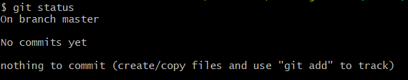
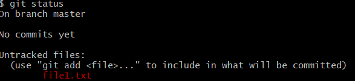

## chpater 6 Part 1에서 수행했던 기본 명령어
### 1. 왜 CLI를 사용할까?
#### 마우스 클릭 vs 키보드 입력
- CLI (=Command Line Interface)
- Git 버전관리 시스템 / GitHub는 Git의 데이터를 저장하는 서버
- GUI는 CLI 기능 중 자주 쓰는 기능들만 있기 때문에 Git의 모든 기능(옵션)을 사용할 수 없음 
- 몇가지 고급명령은 CLI환경에서만 동작

#### CLI 시작 전 이것만은 반드시
- GUI CLI 가장 큰 차이점은 화면에 모든 정보를 보여주는지 명령을 능동적으로 입력하는지 여부
- **CLI 명령 실행 중 발생하는 에러 메세지**
	- CLI환경에서 보여주는 모든 에러나 정보는 세심하게 읽는 것을 권장
- **이 책에서 명령어를 읽는 법**
```
1. 명령어 중 [옵션인자]처럼 대괄호로 둘러싸인 부분은 생략이 가능하다는 뜻
2. <필수인자>처럼 부등호로 둘러싸인 부분은 꼭 입력해야 한다는 뜻
3. CLI 예시에서 # 표시 이후는 주석으로 명령어에 대한 부연설명, 실습할때 입력하지 않을것
4. CLI 예시에서 입력한 명령은 $기호로 시작
5. $ 기호 다음 노란색 음영 텍스트가 입력해야할 명령어
6. 에러메세지나 중요한 메세지는 빨간색으로 구분
```

### Git Bash를 시작하다
#### Git Bash 실행 및 CLI 기본 명령어 파악하기
- $ 기호와 윗줄에 표시된 경로 등을 합쳐서 *프롬프트(Prompt)* 라고 함
	- 프롬프트는 CLI에서 가장 기본적인 정보를 보여줌
	- 경로에서 @앞은 내 컴퓨터의 사용자아이디, @뒤에는 현재 PC이름, '~'는 현재 폴더 위치
	- Git bash를 사용하면 기본적으로 홈 폴더에서 시작 
	- 홈폴더의 전체 경로 = (윈10기준) 'c:\User\사용자ID' 인데 이를 줄여서 '~' 로 표현
- **프롬프트 끝에 브랜치명이 보인다면 이는 Git 작업 폴더라는 의미!**
- **Git Bash 에서 사용할 기본 명령어**

|명령어|설명|
|------|---|
|**pwd**|현재폴더의 위치를 확인|
|**ls -a**|현재 폴더의 파일 목록 확인. -a옵션을 이용해 숨김 파일도 볼 수 있음|
|**cd**|홈 폴더로 이동. 홈 폴더는 사용자 이름과 폴더명이 같고 내 문서 폴더의 상위 폴더|
|**cd <폴더이름>** |특정 위치의 디렉토리로 이동|
|**cd ../** |현재 폴더의 상위 폴더로 이동|
|**mkdir <새폴더이름>** |현재 폴더의 아래에 새로운 폴더를 만들때 사용|
|**echo "Hello Git"**|메아리라는 뜻 / 화면에 "" 안의 문장인 "Hello Git" 을 표시|

#### Git 로컬 저장소 생성하기
- **CLI에서는 꼼꼼한 확인이 중요!!**
- 내문서로 이동하기
	```bash
	$ cd # 홈 폴더로 이동
	$ cd Documents/ # 내 문서 폴더로 이동
	$ pwd #현재 폴더의 위치 확인
	```
- Git 로컬 저장소를 위한 새 폴더 만들기
	```bash
	$ mkdir hello-git-cli # 새로운 폴더 생성
	$ cd hello-git-cli/ # 폴더로 이동
	```
- **Git 로컬저장소를 위해 만든 새폴더 정보 보기**
	```bash
	$ git status
	```
	- ```$ git status``` 는 **Git 저장소의 상태를 알려주는 명령어**
	- 하지만  입력하면 에러 메세지 발생 ```fatal: not a git repository (or any of the parent directories): .git``` '.git 폴더가 없다(=현재 디렉토리는 Git 저장소가 아니다'라고 알려줌)
	- 즉, Git status 명령은 Git 저장소(정확하게는 워킹트리)에서만 정상적으로 수행되는 명령
	```bash
	$ git status
	- Git 워킹트리의 상태를 보는 명령으로, 매우 자주 사용
	- 워킹트리가 아닌 폴더에서 실행하면 오류 발생
	$ git status -s
	- git status 명령 보다 짧게 요약해서 상태를 보여주는 명령, 변경된 파일이 많을때 유용
	```
- Git 저장소 초기화
```bash
$ git init # Git 저장소 생성
$ ls -a # 파일 목록 확인
./ ../ .git/

$ git status #워킹 트리 상태 확인
```



- git init 명령은 현재 폴더에 Git 저장소를 생성
	- **명령의 결과는 '비어있는 Git 저장소를 .git폴더에 만들었다' 라는 내용**
- ls -a 명령으로 현재 폴더 내파일 목록을 확인해보면 [.git]이라는 폴더가 생긴 것을 확인. (이 폴더가 Git의 로컬저장소)
```bash
git init
- 현재 폴더에 Git 저장소를 생성합니다. 
현재 폴더에는 [.git]이라는 숨심 폴더가 생성되는 데 
사실 이 폴더가 로컬저장소입니다.
```
- **로컬저장소가 있는 현재 폴더, 일반적인 작업 폴더를 Git용어로?**
	- *Git 에서는 작업 폴더를 '워킹트리'라고 함*
- **Git 용어 다시 한번 정리!**
	- *워킹트리* : 일반적인 작업이 일어나는 곳
	- *로컬저장소* :  .git 폴더, 커밋은 여기에 들어있다.
	- *작업폴더*: = 워킹트리+ 로컬저장소
	- *Git저장소*: 엄밀하게는 로컬저장소를 의미하지만 넓은 의미로 작업폴더를 의미하기도 함.
```bash
# 워킹트리 (working tree)
워크트리, 워킹 디렉토리, 작업 디렉토리, 작업 폴더 모두 같은 뜻으로 사용된다. 
일반적으로 사용자가 파일과 하위 폴더를 만들고 작업 결과물을 저장하는 곳을 Git에서는 워킹트리라고 부른다. 
공식문서에서는 워킹트리를 '커밋을 체크아웃하면 생성되는 파일과 디렉토리'로 정의한다. 
정확하게는 작업 폴더에서 [.git]폴더(로컬저장소)를 뺀 나머지 부분이 워킹드리 이다.

# 로컬저장소
Git init 명령으로 생성되는 [.git] 폴더가 로절저장소. 커밋, 커밋을 구성하는 객체, 스테이지가 모두 이 폴더에 저장된다.

# 원격저장소
로컬저장소를 업로드하는 곳을 원격저장소라고 부른다. 우리가 사용하고 이는 GitHub 저장소가 원격저장소이다.

# Git 저장소
GIt 명령으로 관리할 수 있는 폴더 전체를 일반적으로 Git프로젝트 혹은 Git 저장소라고 부른다. 
일반적으로 Git 저장소를 작업 폴더와 혼동하기도 하고 워킹트리 + 로컬저장소의 느낌으로 사용하는 듯 하지만 공식문서에서는 로컬저장소와 Git저장소를 같은 뜻으로 사용한다. 
git init 명령을 수행할 때 나오는 메세지도 '비어있는 Git 저장소를 .git에 만듭니다'라고 나온 것을 기억하자
```

#### 옵션 설정하기
- ```git config```  옵션을 보거나 값을 바꿀때 사용
- **Git 옵션**
	- *시스템 환경 옵션* -  PC전체의 사용자를 위한 옵션 
	- *전역옵션* - 현재 사용자를 위한 옵션
	- *지역옵션* - 현재 Git 저장소에서만 유효한 옵션
	- **우선순위**는 *지역 옵션 > 전역 옵션 > 시스템 옵션* 순으로 **지역 옵션**이 가장 높음
- **Git 전역 옵션 설정**
```bash
$ git config -- global user.name # 현재 user.name 확인
```
- **Git 기본 에디터 확인**
```bash
$ git config core.editore

$ git config --global core.editor

$ git config -- system core.editor # 기본 에디터 확인
```
### 3.  기본 CLI 명령어 살펴보기
#### 스테이징과 커밋을 수행하는 add, commit
- 기본적인 git 명령들
```bash
$ git add 파일1 파일2 ... 
파일들을 스테이지에 추가
새로 생성한 파일을 스테이지에 추가하고 싶다면 반드시 add 명령을 사용

$ git commit
스테이지에 있는 파일들을 커밋

$ git commit -a
add 명령을 생략하고 바로 커밋하고 싶을 때 사용
변경된 파일과 삭제된 파일은 자동으로 스테이징되고 커밋된다.
주의할 점은 untracked 파일은 커밋되지 않는다는 것

$ git push [-u] [원격저장소별명] [브랜치이름]
현재 브랜치에서 새로 생성한 커밋들을 원격저장소에 업로드
-u 옵션으로 브랜치의 업스트림을 등록할 수 있음
한번 등록한 후에는 git push 만 입력

$ git pull
원격저장소의 변경사항을 워킹트리에 반영
사실은 git fetch + git merge 명령

$ git fetch [원격저장소 별명] [브랜치 이름]
원격저장소의 브랜치와 커밋들을 로컬저장소와 동기화
옵션을 생략하면 모든 원격저장소에서 모든 프랜치를 가져온다. 

$ git merge 브랜치 이름
지정한 브랜치의 커밋들을 현재 브랜치 및 워킹트리에 반영
```
- **간단한 텍스트 파일 생성하고 확인하기**
```bash
$ echo "hello git" # 화면에 큰 따옴표(" ") 안의 텍스트를 보여준다.

$echo "hello git" > file1.txt # 큰 따옴표 안의 텍스트로 file1.txt 파일 생성

$ ls # 현재 폴더의 파일 목록 확인

$ git status 
```


- git status 로 확인해보면 file1.txt라는 파일이 생성되었고, untracked상태임을 확인

- **생성한 파일 스테이지에 추가하기**
```bash
$ git add file1.txt

$ git status 
On branch master

No commits yet

Changes to be committed:
  (use "git rm --cached <file>..." to unstage)
        new file:   file1.txt <- 변경내용이 스테이지에 올라간 상태
```
- file1.txt파일이 스테이지 영역에 추가된 것을 확인
- git add <file> ... 명령을 사용하면 커밋에 포함할 수 있다는 뜻 (참고로 ...의 의미는 한번에 여러 파일 이름을 지정할 수도 있다는 뜻이다.)

#### reset 명령으로 스테이징 취소하기
- **언스테이징** - 스테이지에서 내리는 동작 
-  ```use "git rm --cached <file>..." to unstage``` 실행결과에서 스테이지에서 내릴 수 있는(*unstage*)메세지가 있음
- ```$ git reset [파일명]...```
	- 스테이지에서 내리기 위해 더 자주 사용
	- **스테이지 영역에 있는 파일들을 스테이지에서 내립니다** *(언스테이징)*
	- 워킹트리의 내용은 변경되지 않음
	- 옵션을 생략할 경우 스테이지의 모든 변경사항을 초기화
- reset 옵션 - *soft, mixed, hard*
	- 옵션 없이 사용하면 *mixed reset*으로 동작

- **스테이지에서 파일 언스테이징하기**
```bash
$ git reset file1.txt # file1.txt 파일 언스테이징

$ git status
On branch master

No commits yet

Untracked files:
  (use "git add <file>..." to include in what will be committed)
        file1.txt <- 언스테이징되어 스테이지에서 내려간 상태

nothing added to commit but untracked files present (use "git add" to track)

$ ls
file.txt

$ cat file1.txt
hello git
```





- 언스테이징하고 ```$ git status```명령어로 확인했을때 상태
- 언스테이징한 뒤 ```$ cat``` 명령어로 **파일 내용이 변경되었는지** 확인, 내용은 그대로 두고 단지 *언스테이징만 한 것*을 알 수 있음

#### CLI로 첫번째 커밋 생성
- **첫 번째 CLI 커밋**
```bash
$ git add file1.txt # 다시 스테이지에 올리기

$ git status

$ git commit # 커밋 실행, vscode 가 열리면 커밋 메세지 입력 후 저장 & 닫기
```
- ```$ git commit``` 명령을 실행하면 vscode가 열림 커밋메세지 적고 저장 후 닫기


	


	- **첫 줄과 둘째 줄 사이는 반드시 한 줄 비워야 함**
	- **첫 줄(제목)** - *작업내용 요약*
	- **다음 줄(본문)** - *자세한 작업 내용 기록*
	- 로그를 볼때나  GitHub의 Pull Request 메뉴 등에서 이 규칙을 활용해 내용을 자동으로 구성하기 때문에 꼭 지키는 것이 좋다.

#### CLI로 log 살펴보기
- ```$ git log``` 명령으로 git *커밋 히스토리* 확인
- **커밋 확인해 보기**
``` bash
$ git status
On branch master
nothing to commit, working tree clean

$ git log --online --graph --all --decorate
* a69defb (HEAD -> master) 첫 번째 커밋
```
- 커밋 히스토리에 보이는 앞 16진수 7자리 숫자 = *커밋 체크섬* 혹은 *커밋 아이디*
- ** git log의 다양한 옵션**
```bash
$ git log
현재 브랜치의 커밋 이력을 보는 명령

$ git log -n <숫자>
전체 커밋 중에서 최신 n개의 커밋만 살펴본다. 아래의 다양한 옵션과 조합해서 쓸 수 있다.

$ git log --online --graph --all --decorate -- all
자주 사용하는 옵션으로 간결하고 멋지게 보여줌 ( 소스트리로 보는 것이 더 좋음)

-- online : 커밋 메세지를 한 줄로 요약해서 보여준다. 생략하면 커밋 정보를 자세히 표시
--graph : 커밋 옆에 브랜치의 흐름을 그래프로 보여준다. GUI와 유사한 모습으로 나옴
--decorate : 원래는 decorate=short 옵션을 의미. 브랜치와 태그등의 참조를 간결히 표시
--all : 옵션이 없을 경우 HEAD와 관계없는 옵션은 보여주지 않음
``` 
- 마지막 명령어는 예쁘고 간결한 결과가 출력된다는 장점
	- 원기올때로 외우면 간단(Online, Graph, All, Decorate)
- **log 명령의 옵션 확인해보기**
```bash
$ git log
HEAD와 관련된 커밋들이 자세하게 나옴

$ git log --oneline
간단히 커밋 해시와 제목만 보고 싶을 때

$ git log --oneline --graph --decorate
HEAD와 관련된 커밋들을 조금 더 자세히 보고 싶을 때

$ git log --oneline --graph --all --decorate
모든 브랜치들을 보고 싶을 때 사용하는 명령

$ git log --online -n5
내 브랜치의 최신 커밋을 5개만 보고 싶을 때 사용
```
- **좋은 커밋의 7가지 규칙**
	```
	1. 제목과 본물을 빈 줄로 분리한다.
	2. 제목은 50자 이내로 쓴다.
	3. 제목을 영어로 쓸 경우 첫 글자는 대문자로 쓴다.
	4. 제목에는 마침표를 넣지 않는다.
	5. 제목을 영어로 쓸 경우 동사원형(현재형)으로 시작한다.
	6. 본문을 72자 단위로 줄바꿈한다.
	7. 어떻게보다 무엇과 왜를 설명한다.
	```

#### 도움말 기능 사용하기
- ```$ git help <명령어>``` 해당 명령어의 도움말을 표시한다. 도움말에는 명령의 의미와 세부적인 옵션들이 매우 자세하게 표시된다.
- **git 도움말 사용해보기**
	```bash
	$ git help status
	$ git help commit
	$ git help add
	```
	- 도움말을 수행하면 웹 브라우저가 열리고 해당 명령어에 대한 내용시 표시됨
	- 명령이 의미하는 바를 알 수 있는 유용한 기능

### 4. 원격저장소 관련 CLI 명령어
#### remote, push, pull
- 이제 원격저장소로 push 진행
- **원격저장소를 등록하는 CLI 명령어**
	- ```git remote add < 원격저장소 이름> <원격저장소 주소>``` 
		- 원격저장소를 등록합니다
		- 원격저장소는 여러개 등록할 수 있지만 같은 별명의 원격저장소는 하나만 가질 수 있다. 통상 첫 번째 원격저장소를 origin으로 지정
	- ```git remote -v``` 
		- 원격저장소 목록 
- **원격저장소 등록 및 push**
```bash
$ git remote add origin <원격저장소 주소>

$ git remote -v
origin  https://github.com/leemyungju9347/hello-git-cli.git (fetch)
origin  https://github.com/leemyungju9347/hello-git-cli.git (push)

$ git push -> 이 부분에서 에러 발생
fatal: The current branch master has no upstream branch.
To push the current branch and set the remote as upstream, use

    git push --set-upstream origin master

```
- *에러 메세지 발생*
	- **[master]브랜치와 연결된 원격저장소의 브랜치가 없어서 발생한 오류**
	- *upstream 브랜치*는 **로컬저장소의 연결된 원격저장소**를 일컫는 단어
	- 업스트림 브랜치 설정을 위해 에러 메세지가 알려준대로 ```--set -upstream``` 사용해서 **origin 저장소의 [master] 브랜치가 로컬저장소의 [master] 브랜치의 업스트림으로 지정되어** git push 명령어 만으로도 에러없이 push 가능

- **git push 재시도**
```bash
$ git push -u origin master # push와 동시에 업스트림 지정

$ git log --oneline -n1
a69defb (HEAD -> master, origin/master) 첫 번째 커밋
-> 지정하고 git log 명령을 통해 보면 HEAD는 [master]를 가르키고 있고
[origin/master] 브랜치도 생겨난 것을 확인

$ git push
```
- HEAD 는 항상 현재 작업 중인 브랜치 혹은 커밋을 가리킴
- 지금 HEAD가 가리키는 *[master]*는 **로컬의 [master]브랜치**, *[origin/master]*는 원격저장소인 **GItHub의 마스터 브랜치** 
- 현재 상태 HEAD,master, origin/master 모두 똑같은 커밋을 가리킴
- ```-u```옵션으로 *업스트림을 지정*했기 때문에 오류 없이 push 가능

#### clone
- **git clone 사용해보기**
```bash
$ pwd
$ cd ../ # 반드시 상위 디렉토리로 이동할 것!
$ git clone <원격저장소 주소> 
fatal: destination path 'hello-git-cli' already exists and is not an empty directory.
-> 이미 [hello-git-cli]라는 폴더가 있기 때문에 실패
```
- ```git clone <저장소 주소> [새로운 폴더명]```
	- 새로 생길 폴더명은 생략 가능
	- 폴더명을 생략하면 프로젝트 이름과 같은 이름의 폴더가 새로 생성됨
	- 저장소 주소는 꼭 원격일 필요 없고 *로컬저장소*도 git clone 명령으로 복제 할 수 있음

- **git clone으로 로컬저장소 복제하기**
```bash
$ git clone <주소> hello-git-cli2
$ ls
$ cd hello-git-cli2
$ git log --oneline
a69defb (HEAD -> master, origin/master, origin/HEAD) 첫 번째 커밋
$ git remote -v # 원격저장소 목록 확인
origin  https://github.com/leemyungju9347/hello-git-cli.git (fetch)
origin  https://github.com/leemyungju9347/hello-git-cli.git (push)
```
- 클론 성공, 명령의 결과로 [hello-git-cli2]폴더가 생김
- 안에는 [master] 브랜치의 최신커밋으로 체크아웃
- **추가 commit and push**
```bash
$ echo "second" >> file1.txt # 파일에 내용 한 줄 추가
$ cat file1.txt
$ git commit -a # 스테이징 없이 바로 커밋
$ git push
$ git log --oneline
79df8ca (HEAD -> master, origin/master, origin/HEAD) 두 번째 커밋
a69defb 첫 번째 커밋
```
- **git pull**
```bash
$ cd ~/Documents/hello-git-cli # 처음 저장소로 이동
$ git log --oneline # 결과를 보면 커밋은 하나뿐
a69defb (HEAD -> master, origin/master) 첫 번째 커밋
$ git pull
$ git log --oneline
 79df8ca (HEAD -> master, origin/master) 두 번째 커밋
a69defb 첫 번째 커밋
$ cat file1.txt
hello git
second
```
- *pull = fetch + merge*
