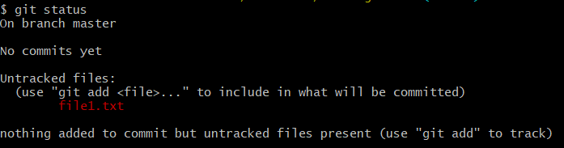
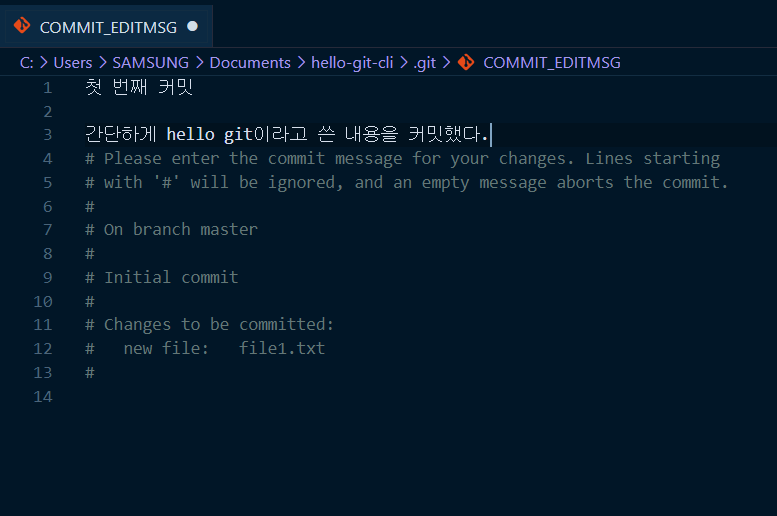
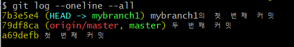
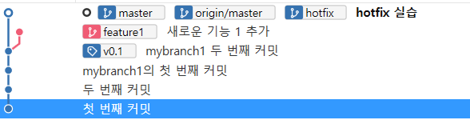
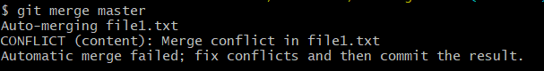
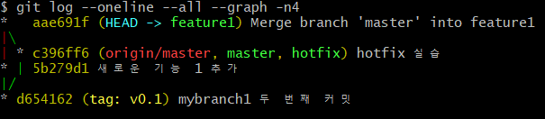
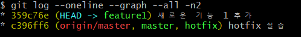
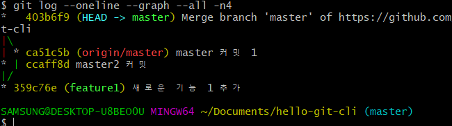
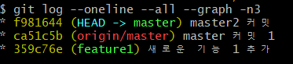

## chpater 6 Part 1에서 수행했던 기본 명령어
### 1. 왜 CLI를 사용할까?
#### 마우스 클릭 vs 키보드 입력
- CLI (=Command Line Interface)
- Git 버전관리 시스템 / GitHub는 Git의 데이터를 저장하는 서버
- GUI는 CLI 기능 중 자주 쓰는 기능들만 있기 때문에 Git의 모든 기능(옵션)을 사용할 수 없음 
- 몇가지 고급명령은 CLI환경에서만 동작

#### CLI 시작 전 이것만은 반드시
- GUI CLI 가장 큰 차이점은 화면에 모든 정보를 보여주는지 명령을 능동적으로 입력하는지 여부
- **CLI 명령 실행 중 발생하는 에러 메세지**
	- CLI환경에서 보여주는 모든 에러나 정보는 세심하게 읽는 것을 권장
- **이 책에서 명령어를 읽는 법**
```
1. 명령어 중 [옵션인자]처럼 대괄호로 둘러싸인 부분은 생략이 가능하다는 뜻
2. <필수인자>처럼 부등호로 둘러싸인 부분은 꼭 입력해야 한다는 뜻
3. CLI 예시에서 # 표시 이후는 주석으로 명령어에 대한 부연설명, 실습할때 입력하지 않을것
4. CLI 예시에서 입력한 명령은 $기호로 시작
5. $ 기호 다음 노란색 음영 텍스트가 입력해야할 명령어
6. 에러메세지나 중요한 메세지는 빨간색으로 구분
```

### Git Bash를 시작하다
#### Git Bash 실행 및 CLI 기본 명령어 파악하기
- $ 기호와 윗줄에 표시된 경로 등을 합쳐서 *프롬프트(Prompt)* 라고 함
	- 프롬프트는 CLI에서 가장 기본적인 정보를 보여줌
	- 경로에서 @앞은 내 컴퓨터의 사용자아이디, @뒤에는 현재 PC이름, '~'는 현재 폴더 위치
	- Git bash를 사용하면 기본적으로 홈 폴더에서 시작 
	- 홈폴더의 전체 경로 = (윈10기준) 'c:\User\사용자ID' 인데 이를 줄여서 '~' 로 표현
- **프롬프트 끝에 브랜치명이 보인다면 이는 Git 작업 폴더라는 의미!**
- **Git Bash 에서 사용할 기본 명령어**

|명령어|설명|
|------|---|
|**pwd**|현재폴더의 위치를 확인|
|**ls -a**|현재 폴더의 파일 목록 확인. -a옵션을 이용해 숨김 파일도 볼 수 있음|
|**cd**|홈 폴더로 이동. 홈 폴더는 사용자 이름과 폴더명이 같고 내 문서 폴더의 상위 폴더|
|**cd <폴더이름>** |특정 위치의 디렉토리로 이동|
|**cd ../** |현재 폴더의 상위 폴더로 이동|
|**mkdir <새폴더이름>** |현재 폴더의 아래에 새로운 폴더를 만들때 사용|
|**echo "Hello Git"**|메아리라는 뜻 / 화면에 "" 안의 문장인 "Hello Git" 을 표시|

#### Git 로컬 저장소 생성하기
- **CLI에서는 꼼꼼한 확인이 중요!!**
- 내문서로 이동하기
	```bash
	$ cd # 홈 폴더로 이동
	$ cd Documents/ # 내 문서 폴더로 이동
	$ pwd #현재 폴더의 위치 확인
	```
- Git 로컬 저장소를 위한 새 폴더 만들기
	```bash
	$ mkdir hello-git-cli # 새로운 폴더 생성
	$ cd hello-git-cli/ # 폴더로 이동
	```
- **Git 로컬저장소를 위해 만든 새폴더 정보 보기**
	```bash
	$ git status
	```
	- ```$ git status``` 는 **Git 저장소의 상태를 알려주는 명령어**
	- 하지만  입력하면 에러 메세지 발생 ```fatal: not a git repository (or any of the parent directories): .git``` '.git 폴더가 없다(=현재 디렉토리는 Git 저장소가 아니다'라고 알려줌)
	- 즉, Git status 명령은 Git 저장소(정확하게는 워킹트리)에서만 정상적으로 수행되는 명령
	```bash
	$ git status
	- Git 워킹트리의 상태를 보는 명령으로, 매우 자주 사용
	- 워킹트리가 아닌 폴더에서 실행하면 오류 발생
	$ git status -s
	- git status 명령 보다 짧게 요약해서 상태를 보여주는 명령, 변경된 파일이 많을때 유용
	```
- Git 저장소 초기화
```bash
$ git init # Git 저장소 생성
$ ls -a # 파일 목록 확인
./ ../ .git/

$ git status #워킹 트리 상태 확인
```


- git init 명령은 현재 폴더에 Git 저장소를 생성
	- **명령의 결과는 '비어있는 Git 저장소를 .git폴더에 만들었다' 라는 내용**
- ls -a 명령으로 현재 폴더 내파일 목록을 확인해보면 [.git]이라는 폴더가 생긴 것을 확인. (이 폴더가 Git의 로컬저장소)
```bash
git init
- 현재 폴더에 Git 저장소를 생성합니다. 
현재 폴더에는 [.git]이라는 숨심 폴더가 생성되는 데 
사실 이 폴더가 로컬저장소입니다.
```
- **로컬저장소가 있는 현재 폴더, 일반적인 작업 폴더를 Git용어로?**
	- *Git 에서는 작업 폴더를 '워킹트리'라고 함*
- **Git 용어 다시 한번 정리!**
	- *워킹트리* : 일반적인 작업이 일어나는 곳
	- *로컬저장소* :  .git 폴더, 커밋은 여기에 들어있다.
	- *작업폴더*: = 워킹트리+ 로컬저장소
	- *Git저장소*: 엄밀하게는 로컬저장소를 의미하지만 넓은 의미로 작업폴더를 의미하기도 함.
```bash
# 워킹트리 (working tree)
워크트리, 워킹 디렉토리, 작업 디렉토리, 작업 폴더 모두 같은 뜻으로 사용된다. 
일반적으로 사용자가 파일과 하위 폴더를 만들고 작업 결과물을 저장하는 곳을 Git에서는 워킹트리라고 부른다. 
공식문서에서는 워킹트리를 '커밋을 체크아웃하면 생성되는 파일과 디렉토리'로 정의한다. 
정확하게는 작업 폴더에서 [.git]폴더(로컬저장소)를 뺀 나머지 부분이 워킹드리 이다.

# 로컬저장소
Git init 명령으로 생성되는 [.git] 폴더가 로절저장소. 커밋, 커밋을 구성하는 객체, 스테이지가 모두 이 폴더에 저장된다.

# 원격저장소
로컬저장소를 업로드하는 곳을 원격저장소라고 부른다. 우리가 사용하고 이는 GitHub 저장소가 원격저장소이다.

# Git 저장소
GIt 명령으로 관리할 수 있는 폴더 전체를 일반적으로 Git프로젝트 혹은 Git 저장소라고 부른다. 
일반적으로 Git 저장소를 작업 폴더와 혼동하기도 하고 워킹트리 + 로컬저장소의 느낌으로 사용하는 듯 하지만 공식문서에서는 로컬저장소와 Git저장소를 같은 뜻으로 사용한다. 
git init 명령을 수행할 때 나오는 메세지도 '비어있는 Git 저장소를 .git에 만듭니다'라고 나온 것을 기억하자
```

#### 옵션 설정하기
- ```git config```  옵션을 보거나 값을 바꿀때 사용
- **Git 옵션**
	- *시스템 환경 옵션* -  PC전체의 사용자를 위한 옵션 
	- *전역옵션* - 현재 사용자를 위한 옵션
	- *지역옵션* - 현재 Git 저장소에서만 유효한 옵션
	- **우선순위**는 *지역 옵션 > 전역 옵션 > 시스템 옵션* 순으로 **지역 옵션**이 가장 높음
- **Git 전역 옵션 설정**
```bash
$ git config -- global user.name # 현재 user.name 확인
```
- **Git 기본 에디터 확인**
```bash
$ git config core.editore

$ git config --global core.editor

$ git config -- system core.editor # 기본 에디터 확인
```
### 3.  기본 CLI 명령어 살펴보기
#### 스테이징과 커밋을 수행하는 add, commit
- 기본적인 git 명령들
```bash
$ git add 파일1 파일2 ... 
파일들을 스테이지에 추가
새로 생성한 파일을 스테이지에 추가하고 싶다면 반드시 add 명령을 사용

$ git commit
스테이지에 있는 파일들을 커밋

$ git commit -a
add 명령을 생략하고 바로 커밋하고 싶을 때 사용
변경된 파일과 삭제된 파일은 자동으로 스테이징되고 커밋된다.
주의할 점은 untracked 파일은 커밋되지 않는다는 것

$ git push [-u] [원격저장소별명] [브랜치이름]
현재 브랜치에서 새로 생성한 커밋들을 원격저장소에 업로드
-u 옵션으로 브랜치의 업스트림을 등록할 수 있음
한번 등록한 후에는 git push 만 입력

$ git pull
원격저장소의 변경사항을 워킹트리에 반영
사실은 git fetch + git merge 명령

$ git fetch [원격저장소 별명] [브랜치 이름]
원격저장소의 브랜치와 커밋들을 로컬저장소와 동기화
옵션을 생략하면 모든 원격저장소에서 모든 프랜치를 가져온다. 

$ git merge 브랜치 이름
지정한 브랜치의 커밋들을 현재 브랜치 및 워킹트리에 반영
```
- **간단한 텍스트 파일 생성하고 확인하기**
```bash
$ echo "hello git" # 화면에 큰 따옴표(" ") 안의 텍스트를 보여준다.

$echo "hello git" > file1.txt # 큰 따옴표 안의 텍스트로 file1.txt 파일 생성

$ ls # 현재 폴더의 파일 목록 확인

$ git status 
```



- git status 로 확인해보면 file1.txt라는 파일이 생성되었고, untracked상태임을 확인

- **생성한 파일 스테이지에 추가하기**
```bash
$ git add file1.txt

$ git status 
On branch master

No commits yet

Changes to be committed:
  (use "git rm --cached <file>..." to unstage)
        new file:   file1.txt <- 변경내용이 스테이지에 올라간 상태
```
- file1.txt파일이 스테이지 영역에 추가된 것을 확인
- git add <file> ... 명령을 사용하면 커밋에 포함할 수 있다는 뜻 (참고로 ...의 의미는 한번에 여러 파일 이름을 지정할 수도 있다는 뜻이다.)

#### reset 명령으로 스테이징 취소하기
- **언스테이징** - 스테이지에서 내리는 동작 
-  ```use "git rm --cached <file>..." to unstage``` 실행결과에서 스테이지에서 내릴 수 있는(*unstage*)메세지가 있음
- ```$ git reset [파일명]...```
	- 스테이지에서 내리기 위해 더 자주 사용
	- **스테이지 영역에 있는 파일들을 스테이지에서 내립니다** *(언스테이징)*
	- 워킹트리의 내용은 변경되지 않음
	- 옵션을 생략할 경우 스테이지의 모든 변경사항을 초기화
- reset 옵션 - *soft, mixed, hard*
	- 옵션 없이 사용하면 *mixed reset*으로 동작

- **스테이지에서 파일 언스테이징하기**
```bash
$ git reset file1.txt # file1.txt 파일 언스테이징

$ git status
On branch master

No commits yet

Untracked files:
  (use "git add <file>..." to include in what will be committed)
        file1.txt <- 언스테이징되어 스테이지에서 내려간 상태

nothing added to commit but untracked files present (use "git add" to track)

$ ls
file.txt

$ cat file1.txt
hello git
```


- 언스테이징하고 ```$ git status```명령어로 확인했을때 상태
- 언스테이징한 뒤 ```$ cat``` 명령어로 **파일 내용이 변경되었는지** 확인, 내용은 그대로 두고 단지 *언스테이징만 한 것*을 알 수 있음

#### CLI로 첫번째 커밋 생성
- **첫 번째 CLI 커밋**
```bash
$ git add file1.txt # 다시 스테이지에 올리기

$ git status

$ git commit # 커밋 실행, vscode 가 열리면 커밋 메세지 입력 후 저장 & 닫기
```
- ```$ git commit``` 명령을 실행하면 vscode가 열림 커밋메세지 적고 저장 후 닫기


	


	- **첫 줄과 둘째 줄 사이는 반드시 한 줄 비워야 함**
	- **첫 줄(제목)** - *작업내용 요약*
	- **다음 줄(본문)** - *자세한 작업 내용 기록*
	- 로그를 볼때나  GitHub의 Pull Request 메뉴 등에서 이 규칙을 활용해 내용을 자동으로 구성하기 때문에 꼭 지키는 것이 좋다.

#### CLI로 log 살펴보기
- ```$ git log``` 명령으로 git *커밋 히스토리* 확인
- **커밋 확인해 보기**
``` bash
$ git status
On branch master
nothing to commit, working tree clean

$ git log --online --graph --all --decorate
* a69defb (HEAD -> master) 첫 번째 커밋
```
- 커밋 히스토리에 보이는 앞 16진수 7자리 숫자 = *커밋 체크섬* 혹은 *커밋 아이디*
- ** git log의 다양한 옵션**
```bash
$ git log
현재 브랜치의 커밋 이력을 보는 명령

$ git log -n <숫자>
전체 커밋 중에서 최신 n개의 커밋만 살펴본다. 아래의 다양한 옵션과 조합해서 쓸 수 있다.

$ git log --online --graph --all --decorate -- all
자주 사용하는 옵션으로 간결하고 멋지게 보여줌 ( 소스트리로 보는 것이 더 좋음)

-- online : 커밋 메세지를 한 줄로 요약해서 보여준다. 생략하면 커밋 정보를 자세히 표시
--graph : 커밋 옆에 브랜치의 흐름을 그래프로 보여준다. GUI와 유사한 모습으로 나옴
--decorate : 원래는 decorate=short 옵션을 의미. 브랜치와 태그등의 참조를 간결히 표시
--all : 옵션이 없을 경우 HEAD와 관계없는 옵션은 보여주지 않음
``` 
- 마지막 명령어는 예쁘고 간결한 결과가 출력된다는 장점
	- 원기올때로 외우면 간단(Online, Graph, All, Decorate)
- **log 명령의 옵션 확인해보기**
```bash
$ git log
HEAD와 관련된 커밋들이 자세하게 나옴

$ git log --oneline
간단히 커밋 해시와 제목만 보고 싶을 때

$ git log --oneline --graph --decorate
HEAD와 관련된 커밋들을 조금 더 자세히 보고 싶을 때

$ git log --oneline --graph --all --decorate
모든 브랜치들을 보고 싶을 때 사용하는 명령

$ git log --online -n5
내 브랜치의 최신 커밋을 5개만 보고 싶을 때 사용
```
- **좋은 커밋의 7가지 규칙**
	```
	1. 제목과 본물을 빈 줄로 분리한다.
	2. 제목은 50자 이내로 쓴다.
	3. 제목을 영어로 쓸 경우 첫 글자는 대문자로 쓴다.
	4. 제목에는 마침표를 넣지 않는다.
	5. 제목을 영어로 쓸 경우 동사원형(현재형)으로 시작한다.
	6. 본문을 72자 단위로 줄바꿈한다.
	7. 어떻게보다 무엇과 왜를 설명한다.
	```

#### 도움말 기능 사용하기
- ```$ git help <명령어>``` 해당 명령어의 도움말을 표시한다. 도움말에는 명령의 의미와 세부적인 옵션들이 매우 자세하게 표시된다.
- **git 도움말 사용해보기**
	```bash
	$ git help status
	$ git help commit
	$ git help add
	```
	- 도움말을 수행하면 웹 브라우저가 열리고 해당 명령어에 대한 내용시 표시됨
	- 명령이 의미하는 바를 알 수 있는 유용한 기능

### 4. 원격저장소 관련 CLI 명령어
#### remote, push, pull
- 이제 원격저장소로 push 진행
- **원격저장소를 등록하는 CLI 명령어**
	- ```git remote add < 원격저장소 이름> <원격저장소 주소>``` 
		- 원격저장소를 등록합니다
		- 원격저장소는 여러개 등록할 수 있지만 같은 별명의 원격저장소는 하나만 가질 수 있다. 통상 첫 번째 원격저장소를 origin으로 지정
	- ```git remote -v``` 
		- 원격저장소 목록 
- **원격저장소 등록 및 push**
```bash
$ git remote add origin <원격저장소 주소>

$ git remote -v
origin  https://github.com/leemyungju9347/hello-git-cli.git (fetch)
origin  https://github.com/leemyungju9347/hello-git-cli.git (push)

$ git push -> 이 부분에서 에러 발생
fatal: The current branch master has no upstream branch.
To push the current branch and set the remote as upstream, use

    git push --set-upstream origin master

```
- *에러 메세지 발생*
	- **[master]브랜치와 연결된 원격저장소의 브랜치가 없어서 발생한 오류**
	- *upstream 브랜치*는 **로컬저장소의 연결된 원격저장소**를 일컫는 단어
	- 업스트림 브랜치 설정을 위해 에러 메세지가 알려준대로 ```--set -upstream``` 사용해서 **origin 저장소의 [master] 브랜치가 로컬저장소의 [master] 브랜치의 업스트림으로 지정되어** git push 명령어 만으로도 에러없이 push 가능

- **git push 재시도**
```bash
$ git push -u origin master # push와 동시에 업스트림 지정

$ git log --oneline -n1
a69defb (HEAD -> master, origin/master) 첫 번째 커밋
-> 지정하고 git log 명령을 통해 보면 HEAD는 [master]를 가르키고 있고
[origin/master] 브랜치도 생겨난 것을 확인

$ git push
```
- HEAD 는 항상 현재 작업 중인 브랜치 혹은 커밋을 가리킴
- 지금 HEAD가 가리키는 *[master]*는 **로컬의 [master]브랜치**, *[origin/master]*는 원격저장소인 **GItHub의 마스터 브랜치** 
- 현재 상태 HEAD,master, origin/master 모두 똑같은 커밋을 가리킴
- ```-u```옵션으로 *업스트림을 지정*했기 때문에 오류 없이 push 가능

#### clone
- **git clone 사용해보기**
```bash
$ pwd
$ cd ../ # 반드시 상위 디렉토리로 이동할 것!
$ git clone <원격저장소 주소> 
fatal: destination path 'hello-git-cli' already exists and is not an empty directory.
-> 이미 [hello-git-cli]라는 폴더가 있기 때문에 실패
```
- ```git clone <저장소 주소> [새로운 폴더명]```
	- 새로 생길 폴더명은 생략 가능
	- 폴더명을 생략하면 프로젝트 이름과 같은 이름의 폴더가 새로 생성됨
	- 저장소 주소는 꼭 원격일 필요 없고 *로컬저장소*도 git clone 명령으로 복제 할 수 있음

- **git clone으로 로컬저장소 복제하기**
```bash
$ git clone <주소> hello-git-cli2
$ ls
$ cd hello-git-cli2
$ git log --oneline
a69defb (HEAD -> master, origin/master, origin/HEAD) 첫 번째 커밋
$ git remote -v # 원격저장소 목록 확인
origin  https://github.com/leemyungju9347/hello-git-cli.git (fetch)
origin  https://github.com/leemyungju9347/hello-git-cli.git (push)
```
- 클론 성공, 명령의 결과로 [hello-git-cli2]폴더가 생김
- 안에는 [master] 브랜치의 최신커밋으로 체크아웃
- **추가 commit and push**
```bash
$ echo "second" >> file1.txt # 파일에 내용 한 줄 추가
$ cat file1.txt
$ git commit -a # 스테이징 없이 바로 커밋
$ git push
$ git log --oneline
79df8ca (HEAD -> master, origin/master, origin/HEAD) 두 번째 커밋
a69defb 첫 번째 커밋
```
- **git pull**
```bash
$ cd ~/Documents/hello-git-cli # 처음 저장소로 이동
$ git log --oneline # 결과를 보면 커밋은 하나뿐
a69defb (HEAD -> master, origin/master) 첫 번째 커밋
$ git pull
$ git log --oneline
 79df8ca (HEAD -> master, origin/master) 두 번째 커밋
a69defb 첫 번째 커밋
$ cat file1.txt
hello git
second
```
- *pull = fetch + merge*

## chapter 7 브랜치 생성 및 조작하기
### 1. CLI로 브랜치 생성하기
#### 브랜치 되돌아 보기
```
1. 커밋하면 커밋 객체가 생긴다. 
커밋 객체에는 부모커밋에 대한 참조와 실제 커밋을 구성하는 파일 객체가 들어있다.
2. 브랜치는 논리적으로 어떤 커밋과 그 조상들을 묶어서 뜻하지만, 사실은 단순히 커밋 객체 하나를 가리킬 뿐이다. 
앞의 그림에서 [master] 브랜치는 정확하게 C3 커밋 객체를, [feature1] 브랜치는 C5 커밋 객체 하나만을 가리킨다.
```
- 브랜치는 언제 사용하는게 좋을까
	- 새로운 기능 추가
	- 버그 수정
	- 병합과 리베이스 테스트
	- 이전 코드 개선
	- 특정 커밋으로 돌아가고 싶을 때

#### 브랜치 생성하기
```bash
$ git branch [-v]
- 로컬 저장소의 브랜치 목록을 보는 명령
- [-v]옵션을 사용하면 마지막 커밋도 함께 표시된다.
- 표시된 브랜치 중에서 이름 왼쪽에 *가 붙어 있으면 HEAD 브랜치

$ git branch [-f] <브랜치 이름> [커밋체크섬]
- 새로운 브랜치를 생성한다
- 커밋체크섬 값을 주지 않으면 HEAD로부터 브랜치를 생성한다.
- 이미 있는 브랜치를 다른 커밋으로 옮기고 싶을 때는 -f 옵션을 줘야한다.

$ git branch -r [-v]
- 원격 저장소에 있는 브랜치를 보고 싶을 때 사용
- 마찬가지로 [-v] 옵션을 추가하여 커밋 요약도 볼 수 있다.

$ git checkout <브랜치이름> 
- 특정 브랜치로 체크아웃할때 사용
- 브랜치 이름 대신 커밋 체크섬을 쓸 수 있다.
- 하지만 브랜치 이름을 쓰는 방법을 권장

$ git checkout -b <브랜치이름> <커밋 체크섬>
- 특정 커밋에서 브랜치를 새로 생성하고 동시에 체크아웃까지 가능하게 한다.
- 두 명령을 하나로 합친 명령이기 때문에 간결해서 자주 사용

$ git merge <대상 브랜치>
- 현재 브랜치와 대상 브랜치를 병합할때 사용
- 병합 커밋(merge commit)이 새로 생기는 경우가 많음

$ git rebase <대상 브랜치>
- 내 브랜치의 커밋들을 대상 브랜치에 재배치 시킨다.
- 히스토리가 깔끔해져서 자주 사용하지만 조심해야 함

$ git branch -d <브랜치이름>
- 특정 브랜치를 삭제
- HEAD 브랜치나 병합이 되지 않은 브랜치는 삭제할 수 없음

$ git branch -D <브랜치이름>
- 브랜치를 강제로 삭제하는 명령
- -d로 삭제할 수 없는 브랜치를 지우고 싶을때 사용. 역시 조심해야 함
```

- 실습 내용 - 새로운 브랜치를 만들고 두번 커밋한 후 다시 마스터 브랜치로 병합
- **브랜치 만들기**
```bash
(master) $ git log --online # 1. 커밋 로그 보기
79df8ca (HEAD -> master, origin/master) 두 번째 커밋
a69defb 첫 번째 커밋

(master) $ git branch # 2. 현재 브랜치 확인
* master

(master) $ git branch mybranch1 # 3. 새로운 브랜치 생성

(master) $ git branch $  # 4. 현재 브랜치 확인
* master
mybranch1

(master) $ git log --oneline --all # 5. 변경된 브랜치 확인
79df8ca (HEAD -> master, origin/master, mybranch1) 두 번째 커밋
a69defb 첫 번째 커밋
```
- 브랜치 만들기 순서 해석
	1. git log 명령으로 현재 커밋, 브랜치 상태 확인. [origin]으로 시작하는 브랜치는 원격브랜치 -> 현재 로컬에는 [master] 브랜치만 존재하는 것을 알 수있음. HEAD 가 [master]브랜치를 가리키는 것도 확인
	2. *master 문구는 *HEAD -> master*와 동일. 프롬프트에 보이는 (master) 역시 HEAD가 [master] 브랜치라는 것을 알려줌
	3. 새로운 브랜치 생성
	4. (+5) git branch와 log명령으로 결과 확인. *가장 최신 커밋에 HEAD, master, mybranch* 모두 위치. 아직 체크아웃 전이기 때문에 HEAD는 여전히 [master]브랜치를 가리킴

- **HEAD에 대해 반드시 기억할 점**
```
1. HEAD는 현재 작업 중인 브랜치를 가리킴
2. 브랜치는 커밋을 가리키므로 HEAD 커밋을 가리킴
3. 결국 HEAD는 현재 작업 중인 브랜치의 최신 커밋을 가리킴
```
### 2. CLI로 checkout 하기
- checkout 명령은 브랜치의 내용을 워킹트리에 반영할때 사용 
- 정확하게는 브랜치가 가르키고 있는 커밋의 내용을 워킹트리에 반영
#### CLI를 이용한 브랜치 체크아웃 및 새 커밋 생성
- **브랜치 만들기**
```bash
# HEAD가 현재 작업 중인 브랜치의 최근 커밋을 가리킨다는 점을 기억할 것!
(master) $ git checkout mybranch1 # 1. 브랜치 체크아웃

(mybranch1) $ git branch # 2. 현재 브랜치 확인
master
* mybranch1

(mybranch1) $ git log --oneline --all # 3. HEAD 변경 확인
79df8ca (HEAD -> mybranch1, origin/master, master) 두 번째 커밋
a69defb 첫 번째 커밋

(mybranch1) $ cat file1.txt # 파일 내용 확인

(mybranch1) $ echo "third -my branch" >> file1.txt # 파일에 내용 추가

(mybranch1) $ cat file1.txt # 변경 내용 확인

(mybranch1) $ git status # 스테이지 상태 확인

(mybranch1) $ git add file1.txt # 스테이지에 변경사항 추가

(mybranch1) $ git commit # 4. 커밋

(mybranch1) $ git log --oneline --all # 5. 변경된 브랜치 확인
```
- 커밋 히스토리 확인



- 브랜치 만들기 실행 과정
	1. 보통 체크아웃 하면 브랜치 변경과 동시에 작업 폴더 내용도 함께 변경됨 but 이번에는 mybranch1 커밋이 이전 브랜치였던 **[master]의 커밋과 같은 커밋이기 때문에** 작업 폴더의 내용은 변경되지 않음
	2. 현재 브랜치 확인. 프롬프토도 mybranch1으로 변경됨
	3. git log 명령으로 *HEAD* 가 [*mybranch1*]으로 변경된 것 확인

- ```$ git checkout <커밋체크섬>```을 하면 어떤 일이 벌어질까?
	- HEAD와 브랜치가 분리되는 **Detached HEAD** 상황이 됨
	- 이상황에서 커밋 생성할 수 있지만, *다른 브랜치로 체크아웃하는 순간* Detached HEAD의 *커밋들은 다 사라져서 안보이게됨*
	- 사실 로컬저장소에는 커밋이 남아있어서 ```$ git reflog```로 복구할 수 있지만 *권장하지 않음*

- **새로운 커밋을 생성하면**
```
1. 새로 커밋을 생성하면 그 커밋의 부모는 언제나 이전 HEAD 커밋이다.
2. 커밋이 생성되면 HEAD는 새로운 커밋으로 갱신된다.
3. HEAD가 가리키는 브랜치도 HEAD와 함께 새로운 커밋을 가리킨다.
```
#### CLI를 이용한 빨리 감기 병합
- **커밋 후 빨리 감기 병합**
```bash
(mybranch1) $ echo "fourth - my branch" >> file1.txt # 파일에 내용 추가
(mybranch1) $ cat file1.txt # 파일 내용 확인

(mybranch1) $ git status # 스테이지 상태 확인

(mybranch1) $ git add file1.txt # 스테이지에 추가
(mybranch1) $ git commit # 1. 신규 커밋 추가

(mybranch1) $ git log --oneline --all --graph # 2. 커밋 로그 보기
* d654162 (HEAD -> master, mybranch1) mybranch1 두 번째 커밋
* 7b3e5e4 mybranch1의 첫 번째 커밋
* 79df8ca (origin/master) 두 번째 커밋
* a69defb 첫 번째 커밋

(mybranch1) $ git checkout master # 3. 마스터 브랜치 체크아웃

(master) $ cat file1.txt # 4. 파일이 이전으로 돌아갔는지 확인
hello git
second

(master) $ git merge mybranch1 # 5. 병합, Fast-forward

(master) $ git log --oneline --all --graph # 로그 확인
* d654162 (HEAD -> master, mybranch1) mybranch1 두 번째 커밋
* 7b3e5e4 mybranch1의 첫 번째 커밋
* 79df8ca (origin/master) 두 번째 커밋
* a69defb 첫 번째 커밋

(master) $ cat file1.txt # 파일 상태 재확인
hello git
second
third - my branch
fourth - my branch
```
- 빨리감기 병합 과정
	1.  새로운 커밋 생성
	2. *기존 커밋을 부모로 하는* 새로운 커밋이 생성됨.  HEAD는 mybranch1, mybranch1은 새커밋을 각각 가리킴
	3. master브랜치로 체크아웃
	4. cat 명령을 확인해보면 텍스트 파일이 이전의 내용임
	5. [master] 브랜치에서 [mybranch1] 브랜치를 병합
- **작업의 흐름이 하나였기 때문에 빨리 감기 병합(fast-forward)으로 완료**

#### reset --hard로 브랜치 되돌리기
- reset은 현재 브랜치를 특정 커밋으로 되돌릴때 사용
- **hard reset**
	- ```$ git reset --hard```  현재 브랜치를 지정한 커밋으로 옮긴다. 작업 폴더의 내용도 함께 변경됨
	- *커밋 체크섬*을 알아야함
- 커밋 체크섬 : git log로 확인할 수 있지만 번거로움. 보통 **HEAD~ 또는 HEAD^로** 시작하는 약칭 사용
- **HEAD~ 또는 HEAD^** 
	- ```HEAD~<숫자>``` HEAD~은 헤드의 부모 커밋, HEAD~2 는 헤드의 할아버지 커밋을 말한다. HEAD~n은 n번째 위쪽 조상이라는 뜻
	- ```HEAD^<숫자>```  HEAD^은 똑같이 부모 커밋. 반면 HEAD^2는 두 번째 부모를 의미. 병합 커밋처럼 부모가 둘 이상인 커밋에서만 의미가 있다.
- **현재 브랜치를 두단계 이전으로 되돌리기**
```bash
$ git reset --hard HEAD~2 # 1. 브랜치 되돌리기
HEAD is now at 79df8ca 두 번째 커밋

$ git log --oneline --all # 2. 로그 확인
d654162 (mybranch1) mybranch1 두 번째 커밋
7b3e5e4 mybranch1의 첫 번째 커밋
79df8ca (HEAD -> master, origin/master) 두 번째 커밋
a69defb 첫 번째 커밋
```
- log 명령을 확인하면 **HEAD -> master가 달라진 것**을 알 수 있음
- **```reset --hard``` 와 ```checkout```**
	- 만약 ```$ git checkout HEAD~2```라고 입력했다면?
		- **[master]브랜치는 그자리에 있고 HEAD만 옮겨짐** ( = 소스트리에서 특정 커밋을 더블 클릭해서 체크아웃 한 것과 같은 상황 = detached HEAD)
		- *다시 [master]브랜치와 HEAD를 연결하려면?*
		```bash
		$ git checkout HEAD~2
		$ git brach -f master
		$ git checkout master
		```
		- **결국 ```reset --hard``` 명령을 위 세 명령을 한 번에 수행하는 명령**

#### 빨리 감기 병합 상황에서 rebase 해보기
- ```$ git rebase <대상 브랜치>``` 현재 브랜치에만 있는 새로운 커밋을 *대상 브랜치 위로 재배치* 시킴
- *현재 브랜치에서 재배치 할 커밋이 없는 경우?* rebase는 아무런 동작 x
- 빨리 감기 병합이 가능한 경우 rebase를 한다면 *빨리 감기 병합*을 함 
- **rebase, push, branch 제거**
```bash
$ git checkout mybranch1 # 1. 브랜치 변경

$ git rebase master # 2. rebase 시도
-> [mybranch1] 브랜치는 이미 [master] 브랜치 위에 있기 때문에 재배치 할 커밋이 없음
rebase master를 수행해도 아무 일이 일어나지 않음

$ git log --oneline --all # 로그 확인, 변한 게 없다.
d654162 (HEAD -> mybranch1) mybranch1 두 번째 커밋
7b3e5e4 mybranch1의 첫 번째 커밋
79df8ca (origin/master, master) 두 번째 커밋
a69defb 첫 번째 커밋

$ git checkout master # 3. 다시 master 브랜치 체크아웃

$ git rebase mybranch1 # 4. 반대 방향에서 rebase
-> rebase 명령으로 [master] 브랜치를 [mybranch1]으로 재배치 시도
빨리감기가 가능한 상황이라 rebase는 merge 명령과 마찬가지로 빨리감기를 하고 작업 종료


$ git log --oneline --all # 변경사항을 확인해보면 빨리 감기 병합이 됨
d654162 (HEAD -> master, mybranch1) mybranch1 두 번째 커밋
7b3e5e4 mybranch1의 첫 번째 커밋
79df8ca (origin/master) 두 번째 커밋
a69defb 첫 번째 커밋

$ git push # 5. push

$ git branch -d mybranch1 # 6. 브랜치 삭제

$ git log --oneline --all -n2  # 로그 확인
d654162 (HEAD -> master, origin/master) mybranch1 두 번째 커밋
7b3e5e4 mybranch1의 첫 번째 커밋
```

#### 배포 버전에 태깅하기
- 주석이 있는 태그를 권장
- ``` $ git tag -a -m <간단한 메세지> <태그이름> [브랜치 또는 체크섬]```
	- a 로 주석 있는 (annotated) 태그를 생성. *메세지와 태그 이름은 필수*이며 브랜치이름을 생략하면 HEAD에 태그를 생성합니다.
- ``` $ git push <원격저장소 별명> <태그이름>```
	- *원격저장소*에 태그를 업로드
- **tag 작성**
```bash
$ git log --oneline # 로그 확인
d654162 (HEAD -> master, origin/master) mybranch1 두 번째 커밋
...
$ git tag -a -m "첫 번째 태그 생성" v0.1 # 주석 있는 태그 작성

$ git log --oneline # 태그 생성 확인
d654162 (HEAD -> master, tag: v0.1, origin/master) mybranch1 두 번째 커밋
...

$ git push origin v0.1 # 태그 푸시
```
### 3. CLI로 3-way 병합하기
- 버그 발생 시 수정 단계
	```
	1. (옵션) 오류가 없는 버전 (주로 Tag가 있는 커밋)으로 롤백
	2. [master] 브랜치로부터 [hotfix] 브랜치 생성
	3. 빠르게 소스 코드 수정 / 테스트 완료
	4. [master] 브랜치로 병합 (Fast - forward) 및 배포
	5. 개발 중인 브랜치에도 병합(충돌 발생 가능성이 높음)
	```
	- 버그가 발생한 상황에서는 원래 작업 중이던 브랜치도 [master] 브랜치로 시작했기 때문에 같은 버그를 가지고 있을 것
	- 때문에 [hotfix] 브랜치의 내용은 [master]브랜치와 개발 브랜치 모두에 병합되어야 함
- **새로운 브랜치 및 커밋 생성**
``` bash
$ git checkout master # master로 체크아웃

(master) $ git checkout -b feature1 # feature1 브랜치 생성 및 체크아웃

(feature1) $ echo "기능 1 추가" >> file1.txt # 파일 내용 수정

...커밋하고 스테이징...

$ git log --oneline --graph --all -n2 # 로그 확인
* 5b279d1 (HEAD -> feature1) 새로운 기능 1 추가
* d654162 (tag: v0.1, origin/master, master) mybranch1 두 번째 커밋
```
- 커밋 한 직후에 장애가 발생했다고 가정
- **hotfix 브랜치 생성, 커밋, master에 병합**
```bash
$ git checkout -b hotfix master # master로부터 hotfix 브랜치 생성, 체크아웃

$ git log --oneline --all -n2 # 2개의 커밋 로그만 보기
5b279d1 (feature1) 새로운 기능 1 추가
d654162 (HEAD -> hotfix, tag: v0.1, origin/master, master) mybranch1 두 번째 커
밋

$ echo "some hot fix" >> file1.txt

... 스테이지에 올리고 커밋하기..

$ git log --oneline -n1
c396ff6 (HEAD -> hotfix) hotfix 실습

$ git checkout master
$ git merge hotfix # 빨리 감기 병합
$ git push # 원격저장소로 push
```	
- hotfix의 커밋은 버그 수정이었기 때문에 이 내용을 현재 개발중인 *[feature1] 브랜치에도 반영*해야 함
- but 소스트리에서 보면 [feature1]브랜치와 [master] 브랜치는 *다른 분기로 진행*되고 있음



- 이 경우에는 *빨리 감기 병합이 불가능*하므로 **3-way 병합**을 해야함
- **병합 및 충돌 해결하기 1**
```bash
$ git checkout feature1 # feature1 브랜치 체크아웃

$ git log --oneline --all # 로그 확인
c396ff6 (origin/master, master, hotfix) hotfix 실습
5b279d1 (HEAD -> feature1) 새로운 기능 1 추가

$ git merge master # 1. master 브랜치와 병합 시도
Auto-merging file1.txt
CONFLICT (content): Merge conflict in file1.txt
Automatic merge failed; fix conflicts and then commit the result.

$ git status # 2. 실패 원인 파악하기
On branch feature1
You have unmerged paths.
  (fix conflicts and run "git commit")
  (use "git merge --abort" to abort the merge)

Unmerged paths:
  (use "git add <file>..." to mark resolution)
        both modified:   file1.txt

no changes added to commit (use "git add" and/or "git commit -a")

-> git satus 명령을 실행해 충돌 대상 파일을 확인 할 수 있음
결과메세지에서 볼 수 있는 것처럼 git merge --abort로 취소할 수도 있음
```
- [master] 브랜치와 병합 시도시 발생하는 에러 메세지



- 비쥬얼 스튜디오로 충돌이 발생한 부분 파일 수정
- **병합 및 충돌 해결하기2**
``` bash
$ cat file1.txt # 최종 변경 내용 확인
hello git
second
third - my branch
fourth - my branch
기능 1추가
some hot fix

$ git add file1.txt # 1. 스테이징

$ git status
All conflicts fixed but you are still merging.
-> git add 및 git status 를 수행하면 충돌한 파일의 수정을 완료한 후에 git commit 명령을 수행하면 된다는 것을 알 수 있음

$ git commit # 2. 머지 커밋 생성
[feature1 aae691f] Merge branch 'master' into feature1

$ git log --oneline --all --graph -n4 # 로그 확인
```
- 병합이 성공적으로 완료. 브랜치 모양 확인

	


### 4. CLI로 rebase 해 보기
#### rebase 사용하기
- 3-way 병합을 하면 *병합 커밋이 생성되어 트리가 다소 지저분해진다*는 단점
- 이럴 때 트리를 깔끔하게 하기 위해 rebase 사용
- rebase는 말그대로 **내 브랜치의 커밋들을 재배치하는 것**
- **rebase의 원리**
	```
	1. HEAD와 대상 브랜치의 공통 조상을 찾는다. (아래 그림의 C2)
	2. 공통 조상 이후에 생성한 커밋들을(C4, C5 커밋) 대상 브랜치 뒤로 재배치한다.
	```
- **재배치된 커밋은 원래의 커밋과 다른 커밋이 됨**
	- rebase 전과 후 *커밋 체크섬이 달라짐
- rebase 명령은 *로컬 브랜치를 깔끔하게 정리*하고 싶을때 사용
- 원격에 푸시한 브랜치를 rebase할 때 조심
	- Git 가이드에서는 **원격 저장소에 존재하는 브랜치에 대해서는 rebase를 하지 말 것을 권장**
- **reset --hard 및 rebase 시도**
```bash
$ git checkout feature1 # 1. feature1으로 전환

$ git reset --hard HEAD~ # 2. 현재 브랜치를 한 단계 되돌린다. 
-> 병합 커밋이 사라짐

$ git log --oneline --graph --all -n3 # 3. 로그 확인
* c396ff6 (origin/master, master, hotfix) hotfix 실습
| * 5b279d1 (HEAD -> feature1) 새로운 기능 1 추가
|/
* d654162 (tag: v0.1) mybranch1 두 번째 커밋

 $ git rebase master # 4. HEAD 브랜치의 커밋들을 master로 재배치
 error: could not apply 5b279d1... 새로운 기능 1 추가
 -> rebase를 시도하지만  merge에서와 마찬가지로 충돌로 인해 실패
 실패메세지를 보면 수동으로 충돌을 해결한 후에 스테이지를 추가할 것을 알려줌
 'git rebase --continue'명령을 수행하라는 것도 알려줌
 
$ git push
```
- **충돌 해결 및 rebase 이어서 하기**
```bash
$ git status # 1. 충돌 대상 확인 및 수동으로 충돌 해결
-> 충돌 파일 확인 후 비쥬얼 스튜디오를 이용해 수동을 파일 수정

$ git add file1.txt # 2. 변경사항 스테이징 및 상태 확인

$ git status

$ git rebase --continue # 3. 리베이스 계속 진행
-> merge는 마지막 단계에서 git commit 명령을 하지만, 
rebase 는 --continue 명령을 사용해야함

$ git log --oneline --graph --all -n2 # 4. 로그 확인
* 359c76e (HEAD -> feature1) 새로운 기능 1 추가
* c396ff6 (origin/master, master, hotfix) hotfix 실습

-> 로그 확인시 merge와는 달리 병합 커밋도 없고 히스토리도 한 줄로 깔금함
또한 [feature1] 브랜치가 가리키는 커밋의 체크섬 값이 바뀜
리베이스를 하면 커밋 객체가 바뀌기 때문.

$ git checkout master

$ git merge feature1 # 5. 빨리 감기 병합
-> [master] 브랜치에서 [feature1] 브랜치로 병합
한 줄이 되었기 때문에 빨리 감기 병합을 수행

```
- rebase를 하고 깔끔해진 history

	

- **rebase 와 마지막 단계 명령어가 다른 이유**
	- **3-way 병합**은 기존 커밋의 변경 없이 *새로운 병합 커밋을 생성* 한 것. 
		- *따라서 충돌도 한번만 발생*
		- 충돌 수정 완료 후 git commit 명령 수행하면 merge 완료
	- **rebase** 
		- 대상 커밋이 여러 개일 경우 *여러번 충돌*
		- 기존의 커밋을 하나씩 *단계별로 수정*하기 때문에 ```$ git rebase --continue``` 명령으로 중단된 rebase를 재시작
		- *여러 커밋에 발생했다면* 충돌 해결마다  ```$ git rebase --continue``` 매번 입력해줘야해서 복잡해짐 -> **병합을 수행**하는 것이 더 간단함

||3-way 병합|rebase|
|---|---|---|
|특징|머지 커밋 생성|현재 커밋들을 수정하면서 대상 브랜치 위로 재배치|
|장점|한 번만 충돌 발생|깔끔한 히스토리|
|단점|트리가 약간 지저분해짐|여러 번 충돌이 발생할 수 있음|

### 유용한 rebase의 사용법 : 뻗어나온 가지 없애기
- 두 대의 PC에서 한 브랜치에 작업을 하는 경우 가지 모양의 커밋이 발생
	- 한 PC에서 머잇을 생성하고 push 진행, 다른 PC에서는 pull하지 않고 커밋
	- 결국 이전 커밋을 부모로 한 커밋이 생김
	- 그 상황에서 뒤늦게 pull을 하면 자동으로 3-way 병합이 됨
- ```reset --hard ```로 병합 커밋을 되돌리고 rebase 사용해서 해결
- **보통 커밋 만들기**
```bash
$ echo "master1" > master1.txt # master1.txt 파일 생성

$ git add master1.txt # 스테이지에 추가

$ git commit -m "master 커밋 1" # 커밋

$ git push origin master # 푸시

$ git log --online -n1 # 로그 확인
ca51c5b (HEAD -> master, origin/master) master 커밋 1

$ ls # 작업 디렉토리 상태 확인
file1.txt	master1.txt
```
- **가지 커밋 만들기**
```bash
$ git reset --hard HEAD~ # 1. HEAD 를 한 단계 되돌리기
HEAD is now at 359c76e 새로운 기능 1 추가
$ echo "master2" > master2.txt # master2.txt 파일 생성

$ git add . # 스테이지에 추가

$ git commit -m "master2 커밋" # 2. 커밋

$ git log --oneline --graph --all -n3 # 3. 로그 확인
```
- **master1 커밋과 master2 커밋 모두 ```359c76e ``` 커밋을 부모로하는 커밋이므로 가지가 생긴 것을 알 수 있음**

	

- **지금 상황에서 ```$ git pull```한다면?**
	- *git full = git fetch + git merge* 이기 때문에 가지를 병합하기 위해서 병합 커밋이 생기고 그러면 *커밋 히스토리가 지저분*해짐
```bash
$ git pull # 1. git pull 수행, 머지 메세지 창은 그냥 닫자.
-> 자동으로 병합 커밋이 생성
$ git log --oneline --graph --all -n4 # 2. 병합 커밋 생성 확인
```
- 로그 병합 커밋 생성 결과

	

- **rebase로 가지 없애기**
```bash
$ git reset --hard HEAD~ # 1. 병합 커밋 되돌리기
-> 커밋을 하나 되돌림
이 경우 마지막 커밋은 병합 커밋이었으므로 병합되기 전 커밋으로 돌아감
이 커밋이 튀어나온 커밋이니 어딘 가에 재배치를 해야함

$ git rebase origin/master # 2. rebase 수행으로 현재 커밋 재배치
-> 로컬 [master] 브랜치의 가지 커밋이 [origin/master] 브랜치 위로 재배치 됨

$ git log --oneline --all --graph -n3 # 로그 확인

$ git pysh # 3. push
```
- 튀어나온 가지가 사라지고 깔끔해짐

	

#### rebase 주의사항
- **원격 저장소에 푸시한 브랜치는 rebase하지 않는 것이 원칙**
- rebase와 git의 동작 원리를 잘 이해하기 전까지 가급적 rebase는 아직 원격에 존재하지 않는 *로컬 브랜치들에만 적용*하기를 권장 

#### 임시 브랜치 사용하기
 - 임시 브랜치 생성 사용 및 삭제
 ```bash
$ git branch test feature1 # feature1 브랜치에서 임시 브랜치 생성

$ git checkout test # test 브랜치 체크아웃

$ echo "임시 브랜치를 생성해서 테스트 중 입니다." > test.txt

$ git add .

$ git commit -m "임시 커밋" # 새로운 커밋 생성

$ git log --oneline --graph --all -n4 # 커밋 로그 보기
* bce6a7e (HEAD -> test) 임시 커밋
| * f981644 (origin/master, master) master2 커밋
| * ca51c5b master 커밋 1
|/
* 359c76e (feature1) 새로운 기능 1 추가

$ git checkout master

$ git branch -D test # 임시 브랜치 삭제

$ git log --oneline -- graph --all -n3 # 로그 확인
* f981644 (HEAD -> master, origin/master) master2 커밋
* ca51c5b master 커밋 1
* 359c76e (feature1) 새로운 기능 1 추가
```
- 임시 브랜치인 [test] 브랜치를 생성하고 커밋 한 후에 다시 [master] 브랜치로 돌아가 [test] 브랜치를 삭제한 결과
- *최종적으로 아무 작업도 남지 않음*
- *commit, merge, rebase*등 다양한 작업을 *미리 테스트해 보고 싶을때* 간단하게 임시 브랜치를 만들어서 사용하고 *불필요해지면 삭제*하는 Git 활용 팁


	


