#### 학습 노트 데이터 수정
- 학습 노트 수정 아이콘 이벤트 연결 및 구현 방향 안내
- **학습 노트 수정 페이지 생성 및 라우터 연결**
	- [동적 라우트 매칭](https://router.vuejs.org/kr/guide/essentials/dynamic-matching.html)
	- 주어진 패턴을 가진 라우트를 동일한 컴포넌트에 매핑해야하는 경우 사용
	```javascript
	const router = new VueRouter({
		 routes: [
		   // 동적 세그먼트는 콜론으로 시작합니다.
			   { path: '/user/:id', component: User }
			]
	})
	```
	- 라우트에 path를 정의할때 id를 파라미터로 받아서 해당 페이지로 진입했을때 아이디를 접근할 수 있는 형태
  
	- 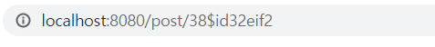
  
		파라미터로 넘긴 url이 잘 넘어간 것을 확인
    
	- 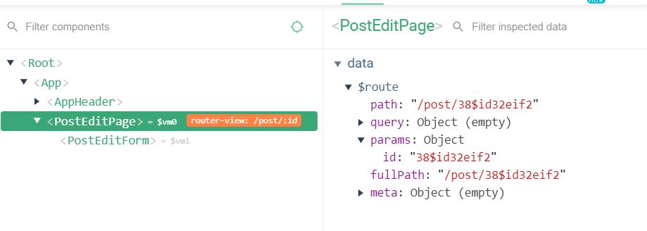
  
		라우트 인스턴스 변수 안에 id(임의로 넘긴 값) 파라미터로 잘 넘어간 것을 확인
	- 특정 학습노트에 데이터를 수정하고 싶다고 하면 해당 학습노트의 아이디를 (파라미터로)넘겨서 값을 수정하면 되는 동작 구조.

- 학습 노트 수정 페이지 마크업 및 라우터 파라미터 연결
	- 스타일이 겹치는 경우에는 해당 폴더 안에 css 파일 만들어서 import로 연결
  
	  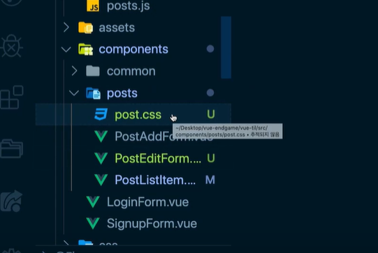

- 학습 노트 수정을 위한 특정 게시물 조회 기능 구현
	- 수정하기 위해서 왜 데이터를 받아와야 하는지? 수정 버튼을 눌렀을때 해당 데이터를 들고와서 타이틀과 본문 내용에 입력해줘야하는 이유?
		- 웹서비스는 동시성을 보장해줘야 함 
		- 한 아이디로 다른 탭에서 여러가지 조작을 했을때 조작된 정보를 최신 정보로 반영해줘야하는게 좋음.(최신보장은 개인설계에 따라 다르지만) 최대한 SPA가 서버에 갔다오지 않는 구조이기 때문에 
		- 특정 아이템에서 버튼을 클릭 했을때 최신의 정보를 한번 이라도 받아오고 나서 거기에 대해 수정했을때 이후에 있을 최소한의 오류를 방지하기 때문
	```javascript
	async created(){
		const id = this.$route.params.id;
		const { data } = await fetchPost(id);
	}
	```
	- 다이나믹 라우트 매칭에 의해서 값이 넘겨진 것을 api로 보내줌

- 학습 노트 수정 API 및 기능 구현
	
	- 특정 게시물을 조회 후에 수정할 수 있도록 Puts 메쏘드가 제공됨
  
		
    
		- body 값은 수정된 title값과 contents값을 인자로 받도록 되어있다.
	- title과 contents값은 input에 연결이 되어있기때문에 edit버튼을 누르고 나면 자연스럽게 submitForm에서 연결이 돼서 호출이 넘어간다.

#### 데이터 포맷팅
- [뷰 필터 안내 문서](https://vuejs.org/v2/guide/filters.html#ad)
	```javascript
		<!-- in mustaches -->
		{{ message | capitalize }}
		<!-- in v-bind -->
		<div v-bind:id="rawId | formatId"></div>
	```
	- ```| ```를 이용해서 필터함수의 이름을 넣어주게 되면 데이터의 필터함수 결과를 결합하여 화면에 뿌려주게 된다.
	- 대문자화, 데이터의 양식을 변경해줄때 유용하게 쓰인다.
	- 날짜 형식에 적용 예시 
	```html
	<div  class="post-time">
		{{ postItem.createdAt | formatDate }}
	</div>
	```
	```javascript
	// 지역필터
	filters: {
		formatDate(value) {
			return  new Date(value);
		},
	}
	```
	- 이 filter는 현재 페이지에 있는 컴포넌트에만 적용되는 필터
- **전역 필터 소개 및 설정**
	-	```utils```에 다른 컴포넌트에서도 사용할 수 있도록 전역 필터 함수 파일을 생성
  
	 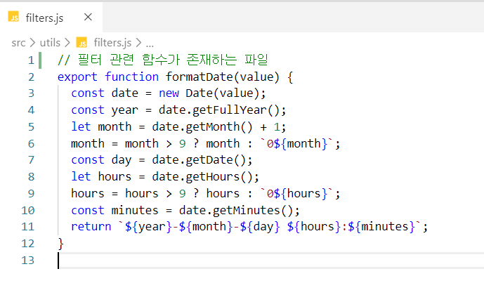
  
	- main.js에서 불러온뒤 전역 필터 설정
		```javascript
		//main.js
		import { formatDate } from  '@/utils/filters';
		
		//전역 필터 설정
		Vue.filter('formatDate', formatDate);
		```

	- **특정한 텍스트를 형식화 할 일이 있을때 전역으로 사용할 것을 추천**

#### 라우터 심화
- [라우터 네비게이션 가드](https://router.vuejs.org/guide/advanced/navigation-guards.html)
	- beforeEnter와 같은 라우터 네비게이션 가드를 이용해서 특정 라우터에 진입하기 전에  **데이터를 먼저 호출하고 받아왔을때만 로드할 수 있도록 하는 동작**
		```javascript
		const router = new VueRouter({
			routes: [
			    {
				   path: '/foo',
			      component: Foo,
			      beforeEnter: (to, from, next) => {
			       // ...
			      }
			   }
			 ]
		})
		```
	- 현재 프로젝트에서는 특정 url에 들어가는 것을 막는 것을 구현해볼 것  [beforeEach](https://router.vuejs.org/guide/advanced/navigation-guards.html#global-before-guards)를 이용해서 활용
- **라우터 네비게이션 가드 기초 코드**
	1. ```router```에서 ```export  default  new VueRouter({})``` 형식을 아래와 같이 바꿔준다.
	
	```javascript
		const router = new VueRouter({})
		export  default router;
	```
	- ```export``` 로 ```router```를 보내줘야지 ```main.js```에서 사용할 수 있다.
	2.  **route에서 ```beforeEach``` 선언**
		- **to :** 이동하려는 페이지
		- **from :** 현재페이지 (어디서부터 왔는지)
		- **next :** 페이지 이동할때 호출하는 API (다음페이지로 이동할 수 있게 호출하는 API)
		```javascript
		router.beforeEach((to, from, next) => {
			console.log(to);
		});
		```
	
	3. 서버를 실행해서 들어오는 기본페이지에서(메인페이지) index.js로그가 찍힌 것을 볼 수 있다.
  
	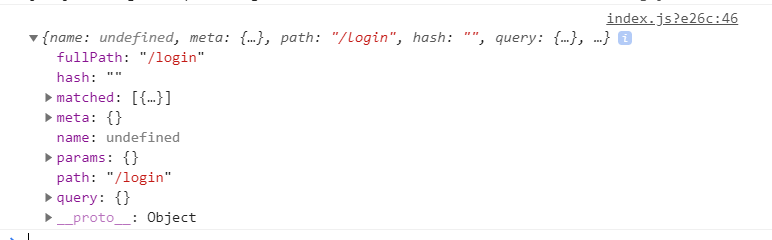
  
	- 중요한점은 **현재페이지에서 next를 call하지 않았기 때문에 라우터가 다음 페이지로 넘어가지 않았다는 것을 확인할 수가 있음.**
  
		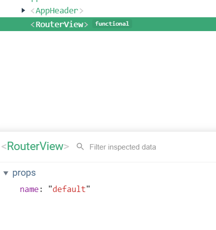
    

4. ```next()``` 호출
	next를 호출해야지만 다음 페이지로 넘어갈 수 있는게 중요한 포인트

- **페이지별 인증 권한 설정(특정페이지에 권한 부여)**
	- ```'/main'``` ```'/add' ``` ```/post/:id' ```에서는
		사용자가 로그인하지 않았으면 들어갈 수 없도록 해야한다.
	- meta 속성 라우터에 부가정보를 등록해주는 속성 (auth는 임의로 정해주는 속성!!)
		``` javascript
		meta: { auth: true }
		```
	- **main, add, post 페이지로 이동했을때 beforeEach가 동작할것이고**  
	- auth가 true인 경우에는 1. 로그인 했는지 체크하고 2. 로그인하지 않았으면 로그인페이지로 넘어가도록  코드를 구현 할 수 있다.
	- **beforeEach에 auth가 true일때 실행할 수 있도록 조건을 줌**
		```javascript
		router.beforeEach((to, from, next) => {
			if (to.meta.auth) {
				console.log('인증이 필요합니다.');
			}
			//console.log(to);
			next();
		});
		```
		- 이렇게 했을떄 해당페이지에 이동할때마다 인증이 필요하다는 로그를 출력함
- 인증되지 않은 사용자 접근 제어
	- 로그인 됐는지 안됐는지의 상태를 확인하기 위해 :
		- store에 있는 isLogin(getters)이라는 로그인 확인 함수를 불러온다 
		- 그리고 스토어를 router에서 불러옴
		- store.getters.isLogin 는 사용자가 로그인을 했는지 안했는지 확인해줌
		```javascript
		if (to.meta.auth && store.getters.isLogin )
		```
	- **인증이 필요한 페이지이면서 , 만약에 사용자가 로그인하지 않았을때만 next('/login'); 로그인페이지로 보낸다.**
	```javascript
	router.beforeEach((to, from, next) => {
		if (to.meta.auth && !store.getters.isLogin ) {
				console.log('인증이 필요합니다.');
				next('/login');
				return
			}
			next()
	});
	```
	- **넘겨보내주고 return을 해줘야하는 이유**
		return을 해줘야지 다음 next를 실행하지 않음. 불필요한 함수실행이 줄어든다.
	- 로그인 안했을때 출력되는 인증메세지는 모달이나, 알림창을 이용하여 띄워주는게 좋다.

- 로그인 상태에 따른 로고 이동 링크 처리
	- ```AppHeader``` 에서 ``` <router-link  to="/"  class="logo">```
	 TIL로고를 눌렀을때 로그인 했을때는 메인으로가고, 로그인 안했을때는 '/'로 가도록 수정
	 - 로그인 상태에 따라 main이나 login을 주도록 computed로 처리
	```html
	<router-link :to="logoLink"  class="logo">
	```
	```javascript
	computed:{
		logoLink() {
		return  this.$store.getters.isLogin ? '/main' : '/login';
	}
	```
- 로그 아웃 관련 코드 수정
	- utils에 생성해놓은 deleteCookie 함수를 불러온뒤 auth, user를 보내줘서 삭제해준다.
		```javascript
		logoutUser() {
			//store에 있는 사용자이름과, 토큰값 삭제
			this.$store.commit('clearUsername');
			this.$store.commit('clearToken');
			//브라우저 저장소에 있는 인증값과 사용자를 삭제
			deleteCookie('til-auth');
			deleteCookie('til-user');
			this.$router.push('/login');
		}
	- store state에 clearToken을 만들고 쿠키를 삭제할때 Token까지 삭제해준다.
	
#### 프런트엔드 테스팅 소개
- 테스팅 환경 구성
	- 14_router-navigation-gaurd 브랜치에 ject.config.js 설정 업데이트
	- package.json에서 script목록에 있는 test:utit을 test로 바꿔주고 --watchAll을 추가해줌
	```javascript
		"test": "vue-cli-service test:unit --watchAll",
	```
	- vue-cli-service에 가면 자바스크립트 testing이 기본적으로 ject로 설정이 되어있는데 jest라는 도구에서 test를 실행할때 watchAll 옵션을 붙여서 테스트코드 파일이 변화되었을때 마다 다시 자동으로 test를 실행해주는 명령어
	- components폴더에 LoginForm.spec.js파일 생성
	- npm t 를 이용해서 testing했을때 확인
  
	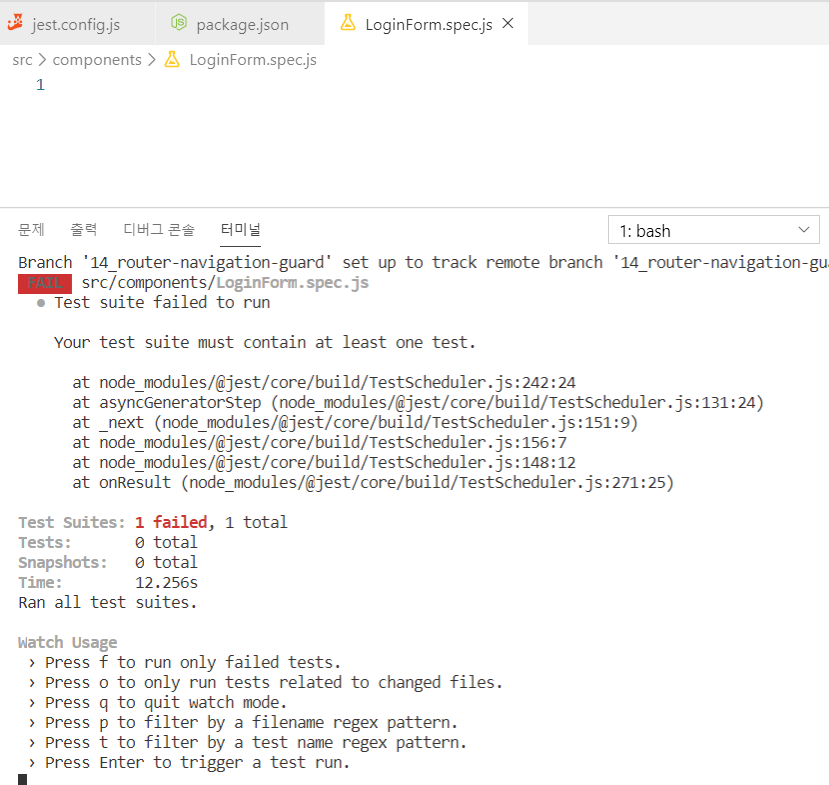

- 테스트 코드가 필요한 이유
	- 기능을 확인할때 값을 직접 입력해보고 되는지 확인하는 과정을 거치는데 테스트 코드를 짜게 되면? 기능이 잘 돌아간다는 검증과 보장을 테스트 코드로 하게 된다  **따라서 역할은 일일이 수작업으로 들어가는 기능 동작에 대한 점검 시간을 줄여주는게 테스트 코드의 큰 목적**
- Jest 소개 ( 테스트코드 작성할때 사용할 라이브러리 )
- **jest - JavaScript Testing Framework**
- [State of JS 2019 - 테스팅](https://2019.stateofjs.com/testing/) : 전세계 개발자 대상 자바스크립트 통계 사이트(자바스크립트 관련 도구, 언어, 프레임워크 포함), jest도구의 인지도 사용량을 볼 수 있음
- [Jest 공식 사이트](https://jestjs.io/en/)

- 자바스크립트 테스트 파일 소개 및 파일 경로 관련 안내
	- 일반 js파일과 test 파일의 차이점
		- 중간에 .spec이나 test가 붙을 경우 자바스크립트 test파일로 인식
	- spec.js 는? 
		- jest.config.js에서 testMatch로 test파일의 대상을 설정할 수 있었음
    
		
    
		- 기본적으로 testMatch 라는 속성이 없으면 tests폴더 밑에  자바스크립트 데스트 파일을 작성해야함
		- 그렇지만 테스트 파일은 테스트 폴더와 근접해 있는게 가장 좋기때문에 ```__test__```폴더를 생성해주거나 근접한 곳에 파일은 만드는게 좋다.
- 자바스크립트 테스트 코드 시작하기
	- math.js에 원하는 함수 생성해서 return해주고 test폴더에서 사용할 수 있게 export해줌
	- test폴더에서 import로 math.js에서 생성한 함수를 가져와서 값을 넣어주고
	- 테스트코드로 확인하는 방법
		- ```describe``` : 연관된 케이스를 그룹화하는 API 
		- ```test()``` : 하나의  테스트 케이스를 검증하는 API 
		- ```expect()```
		
		```javascript
		//loginForm.spec.js
		//테스트코드
		describe('math.js', () => {
			test('10 + 20 = 30', () => {
				const result = sum(10, 20);
				expect(result).toBe(30);
				
			});
		});
		```
		- ```expect(result).toBe(30)```
			해석 : result의 결과가 toBe(30)이 나오는 것을 예상한다.
		- 테스팅 결과
    
		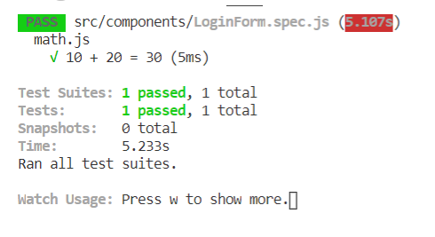
    

- 테스트 코드 작성 팁
	- 빨간색으로 밑줄 에러가 나는 이유 : jest에서 ESLint 문법을 이해할 수 없기 때문
	- 해결방법 - .eslintrc에서 jest : true로 설정해줌
  
		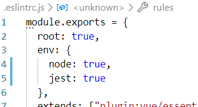
    
	- 실제 테스팅코드를 작성할때 맞는 값보다 **틀린 값을 테스트한 것이 더 정확하다.**
		- 예외케이스 점검
			- ```expect(result).toBe(15)``` 30이 아닌 15를 입력하고 테스팅한 결과
				fail 이 뜨면서 값이 잘못됐다는 메세지를 확인
        
				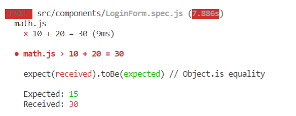
        
			- 매번 값을 다르게 하는 것 보다  ```expect(result).not.toBe(15)``` not을 삽입해서 테스트 케이스가 잘 동작하는지를 점검할 수 있다.
      
			  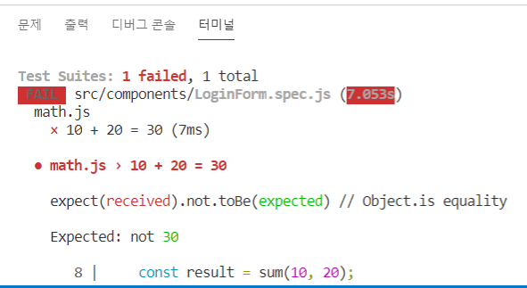
	
