## 5월 19일
### 1. 프로그래머스 코딩테스트
해야하는데.. 한다면 업데이트..
### 2. 인프런 강의듣기 (Vue.js 끝장내기 - 실무에 필요한 모든 것)
#### 회원가입 페이지 개발
 - 헤더 컴포넌트 마크업 및 회원 가입 컴포넌트 생성
		
	 - vim : Vue VSCode Snippets 플러그인에서 제공하는 import 속성을 간편하게 불러오기 위한 도구
	 - 로그인/회원가입 같은 page 컴포넌트는 가급적이면 드라이하게 남아있는게 중요 비즈니스 로직이 많이 연계되어 있는 것 보다, **비즈니스 로직이 들어있는 컴포넌트를 등록할 수 있도록 하는 것이 더 좋다.**
	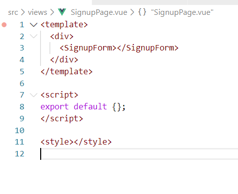
 - 회원가입 폼 마크업

	```html
	
		<form @submit.prevent="submitForm">
			<button type="submit">회원 가입</button>
		</form>
		
	```	
		
	 -  ```<button>``` 으로부터 이벤트 버블링으로 submit을 받고 v-on:submit이라는 뷰 디렉티브를 활용해서 이벤트를 사용한다.
	 - 이 때문에  ```<form>``` 에 method를 걸어주고 버튼을 클릭하면 폼태그에 걸린 submit 이벤트가 실행되는 형태이다.

 - 회원가입 폼 데이터 바인딩 및 이벤트 연결
	 - vda :  Vue VSCode Snippets 플러그인에서 제공하는  데이터 속성을  빠르게 생성할 수 있는 자동완성 

 - 회원 가입 API 요청을 위한 문서 확인
	 - 데이터 요청을 하려면 첫째로 ```data()```에 있는 username, password, nickname을 서버로 보내야 한다.
	 - ### api 문서를 사용할 때 체크해야할 부분
	 
		 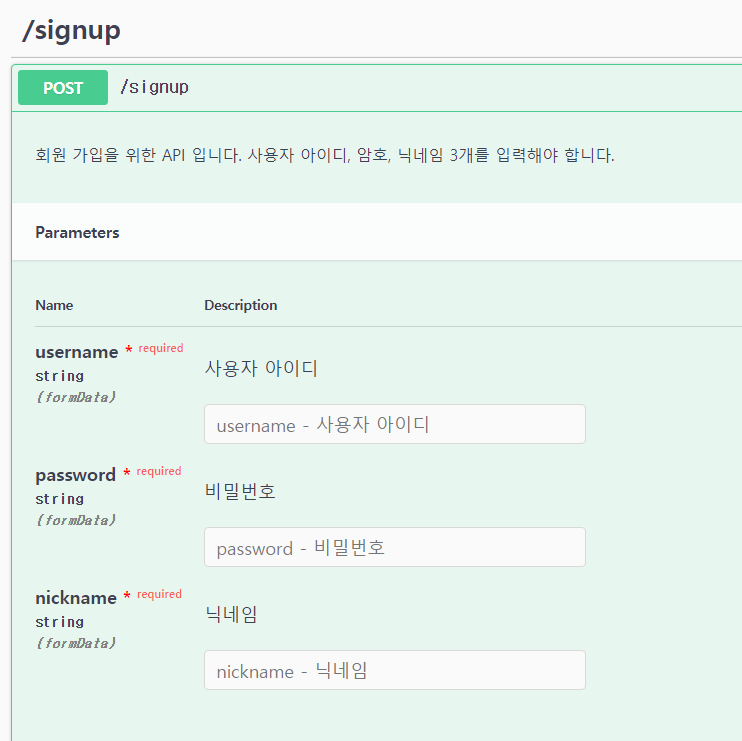
		 
		 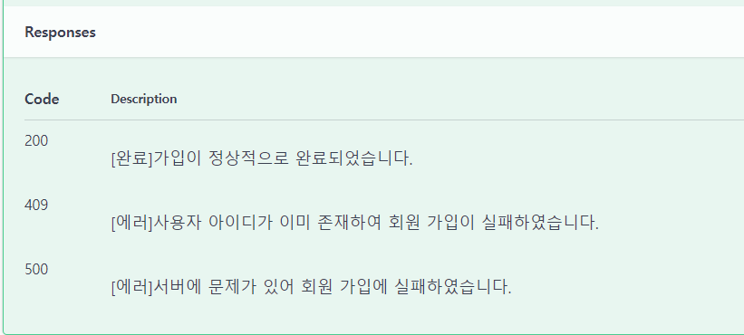
		 
	
		 
		 - **Parameters**  : formData (username, password, nickname)를 인자 값으로 보낸다. post요청은 기본적으로 데이터를 담아서 보내는 역할을 하기 때문에 파라미터에 어떤값이 들어가는지, 파라미터 명과 같이 체크해줘야 한다. 
		 
		 - **Responses**  : 데이터를 받았을때 요청에 대한 **응답**은 200,409,500까지 code 번호로 확인
		 
		 - **POST 방식**은 데이터를 서버로 제출하여 추가 또는 수정하기 위해서 사용하는 방식
		 
		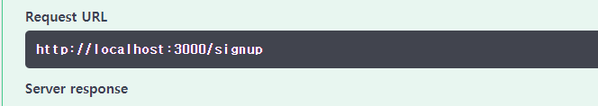
		
		

		 - input 정보를 입력하고 exute를 누르면 요청이 보내진다 . 그랬을 때 우리가 서버쪽으로 보내야하는 주소
		 
		 
		  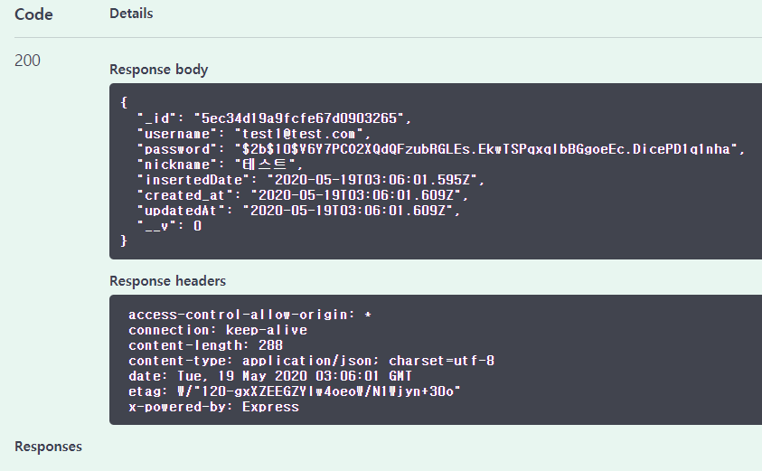
		  
		 - username,id 등등 백엔드로부터 보내준 데이터 응답이 온 것을 확인할 수 있다.

	

 - API 폴더와 회원 가입 API 함수 생성 (axios 구조화 하는 방법)
	 - **Endpoint** :  메소드는 같은 URI들에 대해서도 다른 요청을 하게끔 구별해주는 항목이 있다. 이것을 Endpoint라고 한다. [참고](https://medium.com/@dydrlaks/rest-api-3e424716bab)
	 
	 - 이단계는 post요청으로 보내지 않고 일단 api 호출 먼저 해보는 단계 -> 에러발생,  원래대로라면 데이터를 담아서 post로 서버에 보내줘야한다.  (다음단계에서 진행)
	 - 필요한 데이터의 인자값을 받지 못했기 때문에 에러가 나는 것
	```javascript
		import axios from 'axios'
		function registerUser(){
			//api Endpoint
			const url = 'http://localhost:3000/signup'; 
			axios.post(url)
		}
	```
	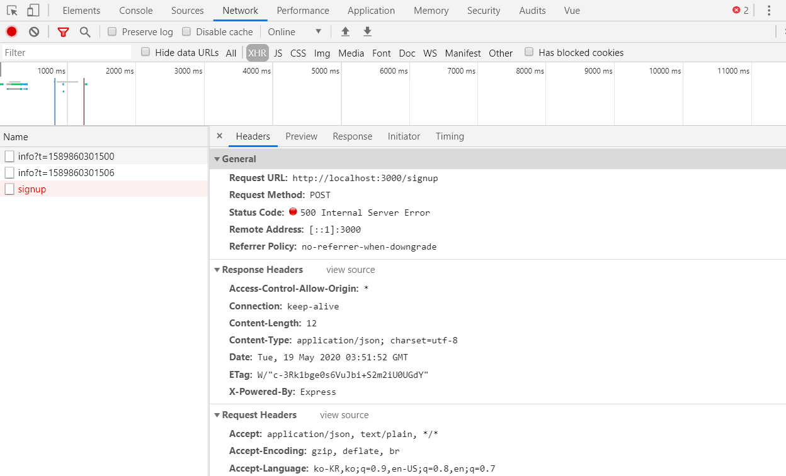
	
	- axios post 결과가 promise 방식이기 때문에 결과를 return 해줘야지 register를 	호출하고 이후에 비동기동작을 수행할 수 있다.
	
 - **회원 가입 API 호출과 주의 사항 & 회원 가입 이후의 동작 구현**
	 - api의 username, password, nickname과 같이 파라미터 값이 이미 정해져있기 때문에 이름을 맞춰서 보내주지 않으면 오류가 난다.

	```javascript
		//비동기 방식으로 값을 넘겨주는 과정
		async submitForm() {
			//UserData를 생성해서 객체로 보내준다.
			const userData = {
				username: this.username,
				password: this.password,
				nickname: this.nickname,
			};
		//넘기면 register에 객체가 전달되면서 post에 유저데이터가 전달된다.
			const { data } = await  registerUser(userData);
			console.log(data.username);

		}
	```

	

	 - [Destructuring](https://joshua1988.github.io/es6-online-book/template-literal.html#%EC%97%AC%EB%9F%AC-%EC%A4%84%EC%97%90-%EA%B1%B8%EC%B3%90-%EB%AC%B8%EC%9E%90%EC%97%B4-%EC%84%A0%EC%96%B8%ED%95%98%EA%B8%B0)
: 이해가 잘 안감 스터디에서 물어보자

#### 실무환경을 위한 프로젝트 설정 

 - API 설정 공통화
	
	 - 대부분 하나의 Endpoint를 바라보게 되어있다.
	
	 - ```axios.create(axiosRequestConfig)``` : 요청할때 공통 설정들을 넣어줄 수 있는 axios api
		 ```javascript
			const instance = axios.create({})
			const vm = new Vue({})
			// 인스턴스를 생성해서 라이브러리를 사용하는 
			방식과 같이 선언해준다.
		```
	
		```javascript
			const instance = axios.create({
				baseURL: 'http://localhost:3000/',
			});
			function registerUser(userData) {
				return instance.post('signup', userData);
			}
		```
	
	
 - env 파일과 설정 방법 ( api 주소를 환경변수로 관리하는 방법 )
	 - 프로젝트의 root위치에 .env 파일 생성한다.
	 - .env 파일: key = 값 형태로 정의할 수 있는 환경 변수 파일
	 
	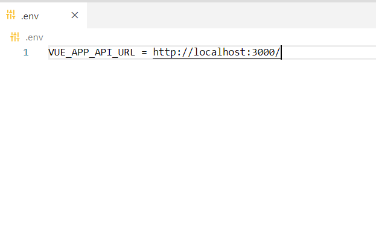
	
	- vue cli에서 ```VUE_APP_ ```접두사가 붙은 변수는 자동 로드 시켜주기 때문에 환경변수의 있는 파일을 ```index.js```에 자동으로 들고 올 수 있게 된다.
	- env로 설정해서 api로 주소를 로드할 경우 웹팩으로 프로토타입하건 빌드하건 안으로 들어올 수 있게된다. 쉽게 들어올수 있도록 뷰의 기본적인 속성 설정들을 env파일로 사용할 수 있도록한다.
	- api 에서 환경변수 로드 하는 방법
		```javascript
			const instance = axios.create({
				baseURL: process.env.VUE_APP_API_URL,
			});
 - Vue CLI의 ```.env``` 파일 규칙(환경변수 규칙)과 실무 환경 구성 방법 
	 - 배포했을때는 로컬호스트를 사용하지않고 도메인 형식으로 소스가 배포 될 것이다.  예를들어,
	 ```
	 //.환경변수파일
		<배포용>		
		 VUE_APP_API_URL_DEPLOYMENT = https://vue-til.com/
		 
		 <개발용>
		 VUE_APP_API_URL = http://localhost:3000/
	``` 
	 - 대부분의 웹서비스는 public한 도메인에 오픈이 되기 때문에 로컬호스트로 배포가 되면 배포를 하고나서 url이 맞지 않는다.
	 - **개발,프로덕션일 때 모드 변경 방식 설명**
		 -   프로토타이핑을 할때는 개발용 / 서버에 배포할때는 배포용으로 key를 분리해서 관리하는게 아니라, 환경변수 파일들을 개발용과 배포용으로 따로 두고 관리하도록  vue cli에서 제공하고 있는 편리한 방법을 사용할 수 있다.
	
		 - **모드 세가지**
			 
			 1 **.env** : 혹시나 develop이나 production이 없을 때 공통으로 들어가야 하는 부분을 적용시켜준다.
			 
			 2 **.env_development** : 로컬서버에 적용
			
			3 **.env_production**: (배포했을때는 배포에 해당하는 도메인 주소를 삽입) npm run build를 했을 때 production모드가 적용
			
		 - **우선순위** (develop -> production -> env)
			 1) development에는 모두의 해당하는 파일이 더 우선순위를 갖는다
			2) 만약 development가 정의되지 않았으면 .env파일의 내용이 적용된다.
			3) development나 production 파일이 없으면 env파일이 가장 높게 우선순위를 갖는다.
			
			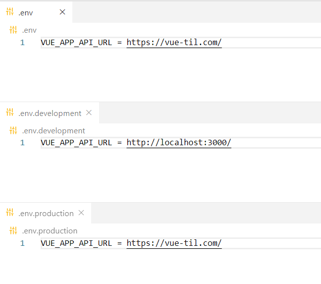
		- [참고링크](https://cli.vuejs.org/guide/mode-and-env.html#modes)

#### 로그인 페이지 개발
 - 네트워크 에러 확인 방법과 에러 처리 코드 구현
	 - 실제로 어플리케이션을 개발할 때 기능보다는 에러처리를 중점적으로 했을 때 완성도 높은 결과물을 얻을 수 있다.
	 - try catch 구문을 사용해서 error처리를 해주면 정확히 라인을 집어주기 때문에 어디서 에러가 났는지 살펴볼 수 있게 되고 더 명확히 확인할 수 있다.
	 - **try catch 구문으로 에러 처리**
		 ```javascript
			 async  submitForm() {
				try {
					//비즈니스 로직
					const  userData = {
						username:  this.username,
						password:  this.password,
					};
					const { data } = await  loginUser(userData);
					console.log(data.user.username);
					this.logMessage = `${data.user.username} 님 환영합니다.`;
						//this.initForm();
						} catch (error) {
							//에러 핸들링할 코드
							//console.log(error.response);
							//error.response : 에러에 대한 상세 내역을 볼 수 있다.
							//console.log(error.response.data);
							this.logMessage = error.response.data;
							//this.initForm();
						} finally {
							this.initForm();
					}
			}
		```
		
	 - catch를 사용할 경우 에러의 객체로 담겨서 catch안의 구문으로 들어온다.
	 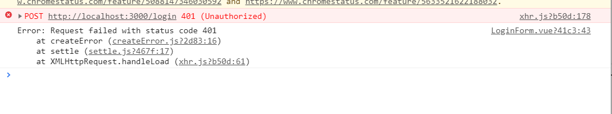
	 
	 - response로 받을 경우 에러 메시지 확인 가능하다 , 백엔드에서 제공하는 에러 메시지 혹은 코드를 화면에 노출시키는게 에러 해결책이다. 
	  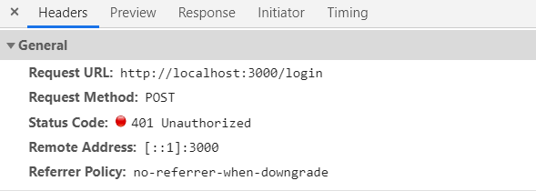
	  
 - 에러 메시지 출력 및 에러 피드백 표시 방법
	 - 콘솔 출력은 개발자만 확인 가능하기 때문에 사용자 입장에서는 화면에 출력하지 않으면 로그인이 실패했는지 확인이 어려움
	 - 이렇게 되면 **잘못된 UX**. 에러가 났을때는 에러메세지를 가공하지 않더라도 **무조건 화면에 표시**해줘야하는게 기본적인 웹의 사용성이다. 에러가 발생 했을 때 에러처리를 잘 하는 방법에 대해 고민해볼 필요가 있다.
	
 - 사용자 폼 유효성 검사 안내 validation
	 -  만약 username이 이메일만 입력해야 한다면 어떻게 피드백을 받아서 처리해야 할건지?
	- 아이디랑 패스워드가 입력이 안됐을 때 활성화 시키지 않는 처리법
	- 로그인, 회원가입시 유효성 검사를 각 파일에 따로 생성하지 않고 공통적으로 관리하기 위해 ```util``` 폴더 만들고 ```validation.js ```파일 생성해서 정규식 검사 함수 넣어준다.
	
		```javascript
			function validateEmail(email) {
				var  re = /^(([^<>()\[\]\\.,;:\s@"]+(\.[^<>()\[\]\\.,;:\s@"]+)*)|(".+"))@((\[[0-9]				{1,3}\.[0-9]{1,3}\.[0-9]{1,3}\.[0-9]{1,3}\])|(([a-zA-Z\-0-9]+\.)+[a-zA-Z]{2,}))$/;
				return  re.test(String(email).toLowerCase());
			}
			export { validateEmail };
		```
	- 데이터의 변화에 따라서 내용을 자동으로 계산해주는 연산식인 computed를 이용
	```javascript
		import { validateEmail } from  '@/utils/validation';
			computed: {
				isUsernameValid() {
				//이메일 연산식을 계산해서 유효하면 'true' 유효하지 않으면 'false' 리턴
				// validateEmail가 유저네임을 하나하나 검사하면서 결과로 true false를 리턴
					return  validateEmail(this.username);
				},
			},
	```
			
	
	
	 - ```template```에 적용
	 

	```html
		<button 
		:disabled="!isUsernameValid || !password || !nickname"
		type="submit"> 회원 가입 </button>
		
	```
	

	 - vue 에서 확인
	 
		 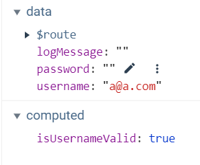
