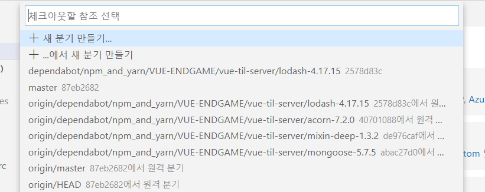
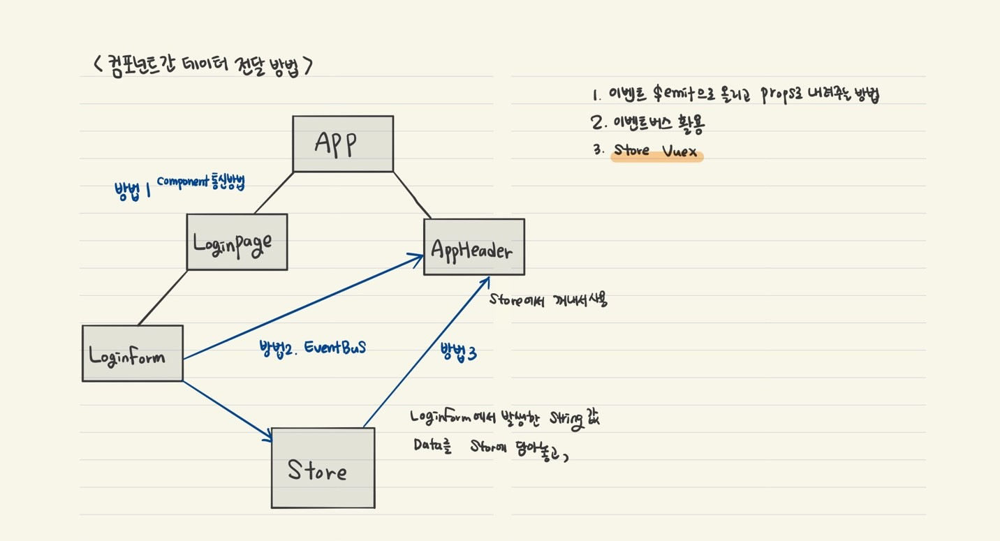
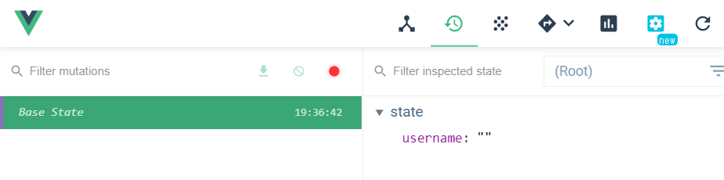
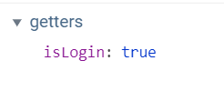

## 5월20일
### 1. 프로그래머스 코딩테스트

 - 소수찾기 (아직 미완성 추후 업데이트)

### 2. 인프런 강의듣기 (Vue.js 끝장내기 - 실무에 필요한 모든 것)
#### 로그인 상태 관리와 스토어
 - 메인 페이지 개발을 위한 브랜치 안내 및 코드 정리
	 - **git checkout 5_styling -f**  : 브랜치 스타일링 적용
			또 git이 말썽이다 브랜치가 안된다 
			브랜치 목록에도 없다. 뭔가 이상하다
      
		
      
      
		
		remote, fetch 별 방법을 다써도 안돼서 확인해보니 아무래도 지난번에 commit하기 위해 폴더들 안에 있는 .git폴더를 삭제한 것이 문제인 것 같다.. (아닐 수도 있음) 결국 처음부터 다시 파일 클론해서 만들었고 시간이 엄청 오래걸렸다.

 - 메인 페이지 라우팅 구현
	 - 페이지 로그인이 끝날을때 다음페이지로 이동할때 어떤 식으로 이동할 수 있는지
	 - [Programmatic Navigation](https://router.vuejs.org/guide/essentials/navigation.html#programmatic-navigation)  
	 - `router.push(location, onComplete?, onAbort?)` 
	 - ```$router.push() ```: 자바스크립트레벨에서 이동하는 것
	 - ```<router-link to=""> ``` :html에서 이동하는 태그 
	 - 두가지 속성은 같음.
   
	 ```javascript
		 //1. 로그인을 하고나서
		 const { data } = await  loginUser(userData); 
		 //2. 콘솔을 찍고			
			console.log(data.user.username); 
			//3.메인 페이지로 이동해라
			this.$router.push('/main');	
	 ```
	
 - 로그인 이후의 동작 설명
	
	 - AppHeader 에 로그인 했을때 '사용자'님 환영합니다 같은 메세지를 띄우기 위해, LoginForm에 있는 로그인했을때 정보(결과)를 AppHeader로 올려줘야하는 상황.이 동작에 대해서 구현해본다.

 - **컴포넌트 간 데이터 전달 방법 3가지와 구현 방향**
	 - 
   
 - **Vuex**
	 - Vuex를 설치하면 package.jscon의 'dependencies'에 저장됨 - 실제 애플리케이션을 동작할때 필요한 라이브러리이기 때문
   
	 - **dependencies 와 devDependencies 차이점**
		 - dependencies : 애플리케이션 로직과 관련된 라이브러리 목록, 최종적으로 npm run build를 했을때 dependencies 라이브러리 내용이 포함돼서 들어감
		 - devDependencies : npm run build수행하더라도 빌드 자원에 포함되지않음			 
      
	 - store 연결됐는지 확인
   
		 
     
		 
 -  **store이용해서 로그인 아이디 헤더에 표시하기**
	 1. **store 설정**
		 ```javascript
			 state: {
					username:  '',
				},
			//state의 데이터를 바꾸는 것
				mutations: {
					setUsername(state, username) {
							state.username = username;
						},
				},
		```
	2. **LoginForm에서 username(사용자)넘겨주기**
		```javascript
		this.$store.commit('setUsername', data.user.username);
		```
	3.  **AppHeader에서 store로 username 받아오기**
		```html
			<span>{{ $store.state.username }}</span>
		```
 - 로그인 했을 때의 헤더 버튼 분기 처리
	 - 로그인이 됐는지 안됐는지의 기준은 state의 상태값을 가지고 판별
	 - **getters**
		 - state의 값이 변경됐을때 특정상태를 계산할수 있도록 한다.
		 - getters의 첫번째 인자는 state
		 - return 값을 가짐
		 - computed라고 생각하면 됨 
		```javascript
		getters: {
			isLogin(state) {
			//빈문자열이 아닐때 로그인이 됐다라는 조건
				return  state.username !== '';
			},
		}
		```
    
	 - 로그인이 되었을때 isLogin으로 조건을 준 값이 true로 들어온 것을 확인
   
	
	
 - 로그 아웃 기능 구현
	 - store에서 username 초기화
		```javascript
			clearUsername(state) {
					state.username = '';	
			},
		```
		
	 - AppHeader에서 로그아웃 버튼 클릭시 실행할 메소드 입력
		 ```javascript
			logoutUser() {
				//clearUsername 호출
				this.$store.commit('clearUsername'); 
				//커밋을 한 다음에 서버시작했을 때의 기본페이지로 
				돌아갈 수 있도록 초기화
				this.$router.push('/login');
			},
		```
			 

		 
