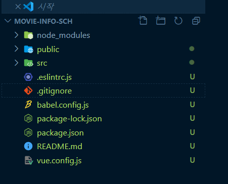

### 프로젝트 첫 생성 순서
1. cli설치 ( 이미 글로벌에 설치했음, vue --version으로 확인) 
2. vue create '프로젝명'으로 SPA설치
3.  프로젝트 옵션 선택 (vuejs 끝장내기 실무 강의 기준)
	- 바벨, css, Unit Testing (Vuex, Router)
	- ESLint + prettier
	- Lint on save
	- Jest
	- In dedicated config files

### ESLint 설치 및 설정
1. 오버레이 제거
	- vue.config.js - js 설정파일 생성
	- ```javascript
		module.exports  = {
				devServer:{
					overlay : false
				}
		}
		```
		웹팩에서 지원하는 오버레이 속성을 꺼줌
2. .eslintrc.js rules에서 eslint규칙이나 prettier 규칙 추가 ( vue-til 파일 참고)
3.  eslint 플러그인이 설치됐는지, 버전이 최신 버전인지 확인
4. ctrl + , vscode 설정 화면 -> Eslint : validate -> settings.jscon에서 편집 으로 가기. validate에 속성 autofix : true
5. prettier 플러그인 들어가서 setting아이콘 -> 사용안함( 작업영역 )
6. ctrl + , 설정 -> format on save -> 체크 해제되어 있어야 함
7.여기까지 했지만 안될경우 package.json 에서 ESLint 버전을 ^5.16.0? 로 낮춰준뒤 npm i 을 하면 강의처럼 작동함

### 절대경로 설정
1. 현재 프로젝트 파일이 제일 상위폴더로 와야함

	
2. jsconfig.json 파일 생성
3.  파일 경로 설정 옵션 추가 ( 실습 파일 참고 )

### axios 설치 안되어 있으면 설치
- npm i axios

### 확인할 것
- 설정 추가 혹은 변경해주면 ctrl+c 서버 끄고 재실행 해주기
- 진행하는 폴더가 최상위 폴더에 있는지 확인
- 설정 변경하고 안되면 프로그램 껐다 재실행도 방법
