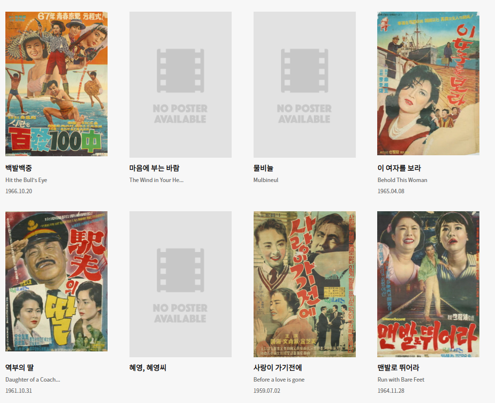

## 6월 4일
### 1. 프로그래머스 코딩테스트
- [모의고사](https://github.com/leemyungju9347/Algorithm/blob/master/Level_01/%EB%AA%A8%EC%9D%98%EA%B3%A0%EC%82%AC.html)

	채점 실패 코드가 복잡하고 알아볼 수가 없다 변수도 정리해야한다. 내일이나 주말에 다시 풀어봐야겠다.
	
### 2. Movie Search app
- 스틸컷... 그냥 뒀다 해결 방법을 알아보자;;
- 상세페이지에서 배우리스트 수상내역 추가함
- 키워드별로 영화 리스트 출력
	- 키워드별로 영화를 출력했는데... 무슨 세기말 영화들이 나온다 당황스럽다 ;;;;;;;;;; 날짜를 최신순으로 영화리스트대로 출력하는 함수를 만들어야할까? api를 바꿔야할까 스터디에서 해결 방안을 얘기해봐야겠다.
	
		
	
- ~~키워드도 끝내야하는데 졸려서 끝낼 수 있을까!?~~  끝냄!
- css도 아직 못끝냈다 모의고사로 시간을 너무 잡아먹었는데 웃긴건 모의고사도 다시 풀어봐야함 .. 
- [vue 라우터 스크롤 동작](https://router.vuejs.org/kr/guide/advanced/scroll-behavior.html)
	- 새로운 페이지로 넘어갈때 스크롤 맨 위로 가도록 초기화
	- 뒤로가기했을때
- 고양이 장례식 검색... 포스터 깜짝 놀람 확인해서 처리할것.....ㅠㅠ
- **해야할것**
	- 더보기 클릭하면 수상내역, 배우들 - 펼쳤다 접었다?
	- 새로운 검색어를 입력했을때 기존에 입력했던 것 리셋
	
