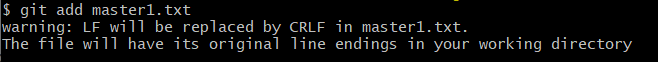

## 6월 22일
### 1. 프로그래머스 코딩테스트
- [정수 제곱근 판별](https://github.com/leemyungju9347/Algorithm/blob/master/Level_01/%EC%A0%95%EC%88%98%20%EC%A0%9C%EA%B3%B1%EA%B7%BC%20%ED%8C%90%EB%B3%84.html)
### 2. 팀 개발을 위한 Git, GitHub 시작하기
- [chapter 7 브랜치 생성 및 조작하기 내용 정리](https://github.com/leemyungju9347/TIL/blob/master/Git/%ED%8C%80%20%EA%B0%9C%EB%B0%9C%EC%9D%84%20%EC%9C%84%ED%95%9C%20Git,%20GitHub%20%EC%8B%9C%EC%9E%91%ED%95%98%EA%B8%B0/Part02_%EC%A4%91%EA%B8%89_CLI%20%ED%99%98%EA%B2%BD%EC%97%90%EC%84%9C%20%EB%B2%84%EC%A0%84%20%EA%B4%80%EB%A6%AC%20%EC%8B%9C%EC%9E%91%ED%95%98%EA%B8%B0.md#chapter-7-%EB%B8%8C%EB%9E%9C%EC%B9%98-%EC%83%9D%EC%84%B1-%EB%B0%8F-%EC%A1%B0%EC%9E%91%ED%95%98%EA%B8%B0)
- 파일을 스테이지에 올리는 작업을 하면 아래와 같은 오류 발생 

	
	
	
	- 맥 또는 리눅스를 쓰는 개발자와 윈도우 쓰는 개발자가 *Git으로 협업*할때 발생하는 **Whitespace** 에러라고 함 
	- 유닉스 시스템에서는 한 줄의 끝이 **LF(Line Feed**)로 이루어지는 반면, 윈도우에서는 줄 하나가 **CR(Carriage Return)** 와 **LF** 즉 **CRLF**로 이루어지기 때문이다.
	- *어느 한 쪽을 선택할지 Git에서 혼란이 온 것!*
	- *윈도우*를 사용하면 ```LF will be replaced by CRLF in.. ``` 이라는 에러메시지가 뜬다고 한다.
	- ```core.autocrlf``` 라는 기능만 켜주면 된다!
		- 이 기능은 개발자가 git 에 **코드를 추가**했을때 (커밋할때)에는 *CRLF를 LF로 변환*해주고, git 의 코드를 **개발자가 조회**할때 (clone한다거나 할때)에는 *LF를 CRLF로 변환*해 준다고 한다.
	- 윈도우의 경우
		```bash
		$ git config --global core.autocrlf true
		```
	- 입력해주니 스테이지에 문제 없이 올라가는데 성공했다.
	- but 분명 ```--global``` 해줬음에도 불구하고 스테이지에 올리는 작업을 할때마다 *변환해달라는 위와 같은 에러*가 뜬다.
	- 어쩔 수 없이 스테이징할때마다 ```core.autocrlf``` 명령을 해주고 있다 그래도 문제없이 작동해주는 것이 고맙다..
- **LF(Line-Feed)**
	- Mac, Linux(Unix 계열) 줄바꿈 문자열 = \n
	- 아스키코드 = 10
	- 커서 위치는 그대로 두고 종이의 한라인 위로 올리는 동작
	- 현재 위치에서 바로 아래로 이동
	- 종이를 한칸 올리기
- **CR(Carriage-Return)**
	- Mac초기 모델 줄바꿈 문자열 = \r
	- 아스키코드 = 13
	- 커서 위치를 맨 앞으로 옮기는 동작
	- 커서 위치를 앞으로 이동
- **CRLF(Carriage-Return + Line-Feed)**
	- Windows, DOS 줄바꿈 문자열  = 
	- CR(\r) + LR(\n) 두 동작을 합쳐서 \r\n
	- 커서를 다름 라인 맨 앞으로 옮겨주는 동작

- **OS마다 줄바꿈을 바라보는 문자열이 다르기 때문에 형상관리를 해주는 Git이바라볼땐 둘 중 어느쪽을 선택할지 몰라 경고 메세지를 띄워준것!**

- [참고 페이지1](https://dabo-dev.tistory.com/13)
- [참고 페이지2](https://blog.jaeyoon.io/2018/01/git-crlf.html)
