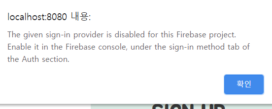
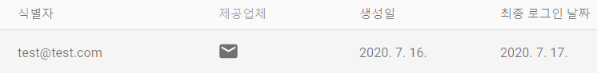

## 7월 16일
### Firebase를 이용하여 로그인 & 회원가입 페이지 구현
#### 1. 프로젝트 설치
1. firebase 콘솔에서 새로운 프로젝트 생성 ([링크](https://console.firebase.google.com/))
	- ```Add-project``` 박스 추가
	- ```moneyboo-project```라는 이름의 프로젝트를 추가함

2. ```Firebase SDK snippet``` 원하는 방식의 cdn 복사
	- html에 붙여넣기하는 cdn과 api key가 담겨있는 cdn이 있음
	- api key가 담겨져 있는 firebase configuration 복사
3. main.js에 붙여넣기
	```js
	import firebase from  'firebase';

	Vue.config.productionTip  =  false;

	// Your web app's Firebase configuration
	var firebaseConfig = {
	  apiKey: "API KEY",
	  authDomain: "프로젝트ID.firebaseapp.com",
	  databaseURL: "https://프로젝트ID.firebaseio.com",
	  projectId: "프로젝트ID",
	  storageBucket: "프로젝트ID.appspot.com",
	  messagingSenderId: "messagingSenderId",
	  appId: "appID"
	};
	// Initialize Firebase
	firebase.initializeApp(firebaseConfig);
	firebase.analytics();
	```
	
4. 프로젝트 터미널에 ```npm install ——save firebase``` 설치

#### 2. 회원가입 페이지
**```createUserWithEmailAndPassword()```** 함수 사용
- 새로운 유저의 이메일과 비밀번호를 만들어주는 firebase 함수
- onResolve 및 onReject 콜백과 함께 firebase의 promise를 반환
- [firebase auth 관련 공식문서](https://firebase.google.com/docs/reference/js/firebase.auth.Auth#createUserWithEmailAndPassword)
- 처음 함수 호출시 에러남
- 콘솔에 error message 출력시 아래와 같은 에러 메세지 발생

	

- 새로운 사용자를 생성하려면 로그인 공급자를 활성화해줘야함

- firebase 홈페이지 콘솔창에서 활성화시켜줌

	- Authentication - 인증부분에서

	   

	- Sign-in method 탭 선택한뒤 이메일/비밀번호 공급자를 활성화 시켜주면 됨

	   

- 완료된 코드
```js
submitForm() {

	firebase.auth().createUserWithEmailAndPassword(this.username,this.password)
	.then(
		function(user) {

		console.log(user);

		alert('계정이 생성되었습니다!🎉');
	},
	function(err) {

		console.log(err);

		alert(err.message);
	},
	);
}	
```
- 이 과정을 마치면 계정이 생성됨. firebase 콘솔창에서 계정을 정확히 확인해줘야함
	- 방금 생성한 유저가 사용자 목록에 있어야한다.

		
	

#### 로그인
- **```signInWithEmailAndPassword()```** 함수 사용
	- 이메일과 암호를 매개변수로 사용하고 promise로 반환
	- firebase에 유저가 저장되어 있다면 로그인 성공
	```js
	submitForm() {
	
		firebase
		.auth()
		.signInWithEmailAndPassword(this.username, this.password)
		.then(
		function(user) {
			alert('로그인되었습니다!😊');
			console.log(user);
		},
		function(err) {
			alert(err.message);
		},
		);
	},
	```	
