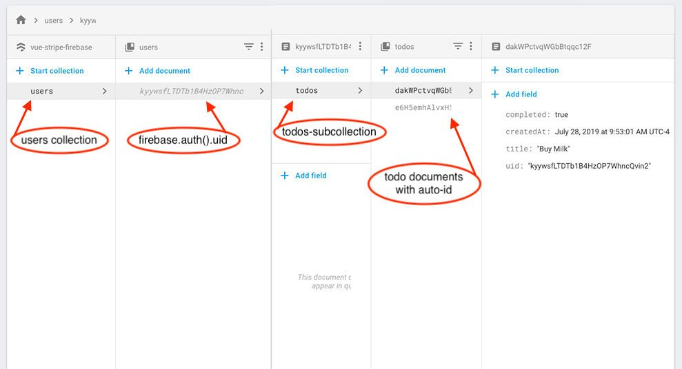

### 머니부 프로젝트를 위한 기능 구현 - firestore DB, user쿠키 등록
- **로그인한 유저 uid 값이랑 useremail 쿠키에 등록**
- **firestore 데이터베이스 구조 연구, 설계**

#### firestore 데이터모델
```js
collection (큰제목)
	document (소제목)
		field (내용물)
```





- **Cloud Firestore는 NoSQL 문서 중심의 데이터베이스**
- SQL 데이터베이스와 달리 테이블이나 행이 없으며 ```collection```으로 정리되는 ```document```에 ```데이터```를 저장하는 방식
- ```collection```의 문서 이름은 고유함. 사용자 ID와 같은 고유한 키를 제공하거나 Cloud Firestore에서 무작위 ID를 자동으로 만들도록 할 수 있음
- [데이터 모델 참고 출처](https://firebase.google.com/docs/firestore/data-model?hl=ko)

#### firestore에 user 정보 저장
- 첫 회원가입을 하면 users라는 collection에 회원가입시 발급되는 user 고유의 uid값의 document를 생성해준다.
- 생성한 document의 moneyboo라는 collection을 만들어주고, moneyboo라는 collection의 doc으로 userInfo값을 생성해줬다.
- userInfo는 user 개인 정보를 저장해두는 곳, 회원가입하면 자동으로 생성되도록 구현
- 회원정보를 가져올때 userInfo에서 가져올 수 있음
- 이를 이용해 회원가입하면 발급받은 uid로 하위 문서를 관리함
- 그렇기때문에 회원가입, 로그인을 하지 않으면 페이지를 이용할 수 없음.

#### userInfo 문서 구조
```js
 users (collection)
	- currentUid (document)
		- moneyboo (sub collection)
			- userInfo (doc) - 명주
				- create_date (field)
				- email (field)
				- login_status (field)
				- nickname (field)
```

#### 참고 링크 
- [Firestore DB 설계시 참고할 내용, 팁](https://12teamtoday.tistory.com/60)

- [add Array Firestore](https://stackoverflow.com/questions/47947533/add-array-firestore)

- [Firebase Firestore 요약](https://relz.tistory.com/21)
- [주기적으로 Firestore의 data가 추가 될 때마다 앱으로 push 보내기 ](https://softwaree.tistory.com/89)

- [Firebase 데이터를 자바 스크립트로 배열에 저장](https://stackoverflow.com/questions/39154617/store-firebase-data-into-array-in-javascript)(https://stackoverflow.com/questions/39154617/store-firebase-data-into-array-in-javascript)

- [firestore에서 sub collection 생성해서 comment 관리하기](https://velog.io/@dooreplay/firebase-sub-collection)
