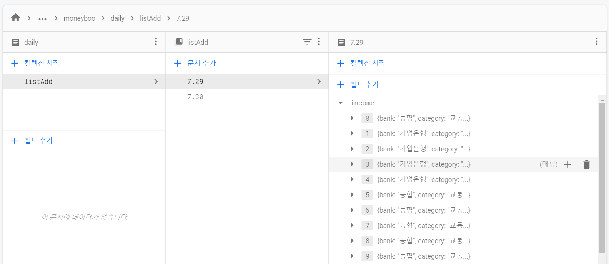

### ```firestore```를 이용해 ```DB``` 저장하고 불러오기 (dailyPage)
#### 데이터 추가 / 출력
- **```set ()```**

	```js
	.set({ arrayName : [vlaue1, value2, value3] })
	// '배열이름' : '배열'을  { } 콧수염괄호로 묶어준다.
	// '배열이름'을 꼭 해줘야함
	```
- **```update ()```**
		- 필드 값을 갱신
- **```add()```**
	- ```set()```과 같은 기능
- **```get()```**
	- 데이터를 가져오는 기능
	```js
	// 예시
	const todayListRef = 
			this.dailyListAddRef().doc(this.conversionDate(today));
		todayListRef.get().then(doc  => {
			doc.data().income.forEach(element  => {
				this.listIncomeDataArr.push(element);
			});
	});
	```

#### ```arrayUnion(vlaue)```
- ```firebase.firestore.FieldValue.arrayUnion(vlaue)```
- 배열로 field 값을 저장하는 방법
- 처음에 시도했을때는 안돼서 변수에 push로 저장해 사용하다가 새로고침을 하면 변수가 refresh되어 db값이 초기화되는 것을 확인하고 바로 사용했더니 또 됐다. 대신 firebase를 import로 불러와서 사용중이다.
- ```const  FieldValue = dailyListAddRef.FieldValue```

#### ```DocumentSnapshot< T >```

#### ```QuerySnapshot()```

#### ```onSnapshot()```
- 실시간으로 데이터를 업데이트 해주는 기능
- 데이터가 추가되면 새로고침을 하지 않아도 화면에 실시간으로 업로드되는 기능
- but 이름이 snapshot이라서 그런가 기존에 있던 데이터를 추가하면 기존에 있던 데이터 + 새로 추가한 데이터가 다 같이 추가된다... 유용한 기능인 것 같은데 이 문제를 해결해야한다..
- [링크1](https://firebase.google.com/docs/firestore/query-data/listen?hl=ko)
- [링크2](https://www.python2.net/questions-761305.htm)
- [링크3 ](https://forest71.tistory.com/189)

#### dailyPage DB 문서 구조
```js
 users (collection)
	- currentUid (document)
		- moneyboo (sub collection)
			- daily (doc)
				- listAdd (sub sub collection)
					- 7.29 (doc)
						- income (field title) = array
							[{listData}][0] (field)
							[{listData}][1] (field)
							[{listData}][2] (field)
						- expend
							[{listData}][0]
							[{listData}][1]
							[{listData}][2]
					- 7.30 (doc)
					- 7.31 (doc)
```



현재 데일리페이지 문서 구조화하고 리스트를 DB에 배열로 저장하고 출력까지 마친 상태 내일은 실시간 업데이트를 도전해보자..
