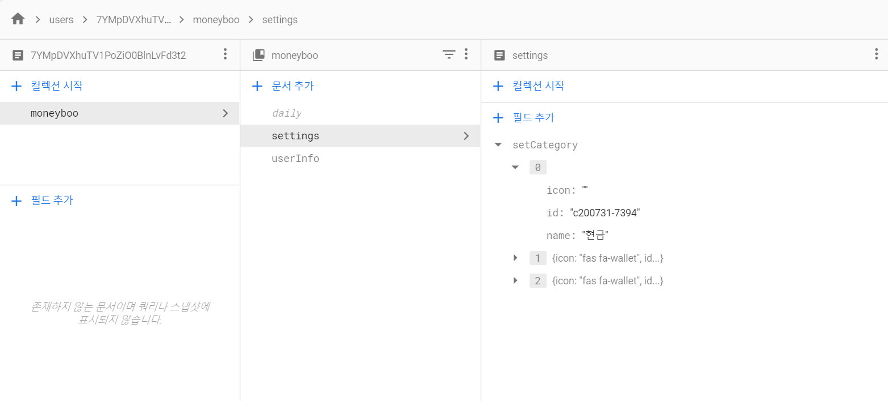

### ```firestore```를 이용한 ```DB``` 연동과 기능 구현
### firestore
- dailyPage 필드 income이랑 expend로 나눠서 입력

- 처음 회원가입하고 로그인한뒤 데일리 페이지를 들어갔을때 다음과 같은 에러 발생
```Uncaught (in promise) TypeError: Cannot read property 'income' of undefined at eval (DailyList.vue?c2c6:88)```
	> 초기 document가 생성되지 않았을때? 혹은 데이터들이 없을때 불러오지 못해서 에러가 발생하는 것이다. 이것도 다른 방식으로 조건을 주고나 예외처리 해줘야겠다.
	
	- **income/expend 문제 해결해주자!!**

- **DB  ```set()``` , ```update()``` 문제 해결**

	- **처음 생성되지 않는 문서를 초기화할때 ```set()```함수를 사용해줘야함**

	- ```arrayUnion()```이라는 배열을 추가해주는 함수는 ```update()```를 사용해서 추가해줘야함

	- but ```document```가 생성되지 않은 db는 ```update()```함수를 사용 할 수 없음, 초기에 ```set()```으로 먼저 초기화해줘야함
	- ```doc().get().then()```으로 함수를 불러와서 ```exists```를 이용해 조건을 줘서 값이 있으면 listData를 ```set()```해주고, 값이 있다면 ```arrayUnion```을 이용해 값을 ```update()```시켜줬음
	
	- settingsPage도 이러한 방식으로 등록해줬더니 해결!
	- **이렇게 하면 신규로 등록된 사용자도 에러 없이 등록할 수 있다!**
	
	```js
	// 완성 코드
	dailyListAddRef
		.doc(this.conversionDate(today))
			.get()
			.then(docSnapshot  => {
			// 만약 document값이 없으면 초기값 셋팅해주고
			if (!docSnapshot.exists) {
				dailyListAddRef
					.doc(this.conversionDate(today))
					.set({ list: [listData] });
					// 만약 값이 있다면 배열을 업데이트 해줄것
			} else {
				dailyListAddRef.doc(this.conversionDate(today)).update({
					list: firebase.firestore.FieldValue.arrayUnion(listData),
			});
		}
	});
	```
> 시행착오가 많았던 코드.. doc 값이 셋팅되어 있지 않으면 레퍼런스 참조값을 변수에 담아서 사용하는 방식이 안됐었다. 또 어떤 문제가 발생할까 걱정되지만 그래도 일단을 해결!

#### settingPage DB 구조
```js
- moneyboo (collection)
	- settings (doc)
		 - bankAsset (array title) (field)
			[bank,asset,id][0] 
			[bank,asset,id][1]
			[bank,asset,id][2]
		- cashAsset(field) : 금액
		- cashGoal (field) : 금액
		- totalGoal (field) : 금액
		- setCategory (array title) (field)
			[id,name,icon][0] 
			[id,name,icon][1]
			[id,name,icon][2]
```



> 일단 setCategory DB  추가결과

#### pull request
- 원본저장소에 ```pull request```
	- 원본저장소랑 다른 팀원들 코드랑 병합하고 dailyPage에 에러가 생겼다.
	- firebase의 문제일까? 쿠키이외에 반복문과 이것저것 섞여서 과부하가 생긴 것일까
#### 새로고침 문제
- 기존 방법은 쿠키에서 등록하고 store로 받아오는 방식으로 화면에 표시
	> 이런 방식으로 했더니 바로 연동되지 않고 새로고침을 해야 화면에 보여짐
- **```store```에 먼저 보내고 쿠키로 받아오는 방식으로 하면 브라우저에 바로 연동하는 방식으로 바꿀 것**

#### firebase 함수
- ```addOnSuccessListener```
- ```onSuccess```
- ```js
	this.afs.doc('/path').snapshotChanges().take(1).do(d => d.payload.exists)
	```
> 웹문서에는 지원 안될 수도 있지만 일단 유용해보이는 함수 참고용으로 메모.. 

#### 참고한 링크
- [안전하게 데이터 쿼리](https://firebase.google.com/docs/firestore/security/rules-query?hl=ko#in_and_array-contains-any_queries)
- [firestore 함수들 정리](https://sweetdev.tistory.com/490)
- [Firebase Security-rules 정리](https://gist.github.com/Dohyunwoo/b8370f208619c7f44a2a13fb390e1514)
- [FireStore가 없으면 문서를 만듭니다. - stackoverflow](https://stackoverflow.com/questions/52277020/firestore-create-a-document-if-not-exist)
- [https://github.com/angular/angularfire/issues/1272](https://github.com/angular/angularfire/issues/1272)
- [Cloud Firestore에 데이터 추가하기](https://softwaree.tistory.com/44)
