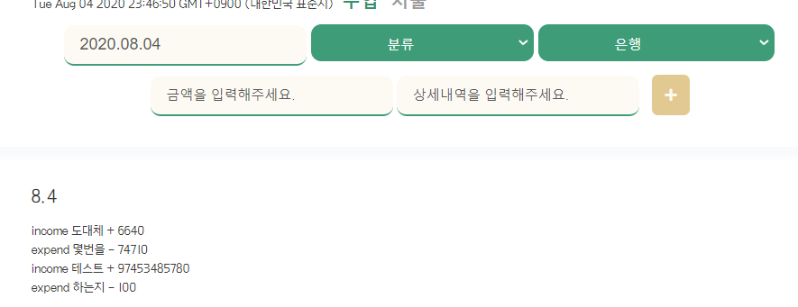
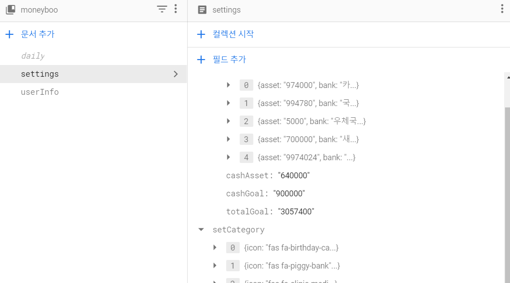

### firebase로 DB 관리
#### vuejs 를 이용한 firestore 
- 실시간 바인딩
- 검색어 firestore [__ob__: Observer]
	- [vue-firestore](https://github.com/gdg-tangier/vue-firestore)
	- [VueJS, Vuex 및 Cloud Firestore로 실시간 채팅 앱 구축](https://medium.com/js-dojo/build-a-realtime-chat-app-with-vuejs-vuex-and-firestore-32d081668709)

	- [[Vue JS는 객체 배열 대신 [__ob__ : Observer] 데이터를 반환합니다.](https://stackoverflow.com/questions/52873516/vue-js-returns-ob-observer-data-instead-of-my-array-of-objects)](https://stackoverflow.com/questions/52873516/vue-js-returns-ob-observer-data-instead-of-my-array-of-objects)

#### firstore 특정필드만 삭제
- 삭제할때 필요한 부분 같아서 일단 메모..
```js
// Get the `FieldValue` object  
var FieldValue = require('firebase-admin').firestore.FieldValue; 

// Create a document reference  
var cityRef = db.collection('cities').doc('BJ'); 

// Remove the 'capital' field from the document  
var removeCapital = cityRef.update({ 
	capital: FieldValue.delete() 
});
```
- [출처 - jybaek](https://jybaek.tistory.com/733)

#### DailyPage firstore
- dailyList 출력완료
	- ```querySnapshot.size```
		- 현재 내 collection 사이즈 (데이터 길이) 가 0 이면 값을 등록해주라는 log 메세지를 출력하고, 값이 있으면 데이터를 출력하라는 조건을 주기위해 사용
	- firstore에 있는 데이터를 불러오는 것은 수월하게 했지만 템플릿에 for문으로 출력하는 것은 시간이 좀 걸렸다.
	- 배열안에 객체있고 객체안에 배열이 있어서, 또 내가 원하는대로 출력하기 위한 데이터 형식으로 만드는데에 어려움이 있었다.
	
	- 결국 ```arr = { id : document.id, data : [{data1}] , [{data2}] , [{data3}] }``` 이러한 객체 형태로 출력
	
	- 아래는 실제 코드 중 일부분
		```js
		docSnapshot.forEach(doc  => {
			this.getAllListData.push({
				id: doc.id, // document 이름
				data: doc.data().listData,
			});
		});
		``` 
		
	- 템플릿 출력문 일부분
		```html
		<ul>
			// v-if : 등록된 데이터가 0일때
			<li v-if="listArrLength  ===  0">{{ logMessage }}</li>
			// v-else 
			<li 
				v-for="(item, index) in getAllListData" 
				:key="index"  
				v-else
				>
				// id = document.id = document name = 등록한 date
				<strong>{{ item.id }}</strong> 
				
				// getAllListData >> getAllListData.data Array
				<ul>
					<li v-for="list in item.data" :key="list.id">
						// 수입
						<p v-if="list.item ===  'income'">
							+ {{ list.price }}
						</p>
						// 지출
						<p v-else> - {{ list.price }} </p>
					</li>
				</ul>
			</li>
		</ul>
		```
	- 템플릿 출력 결과 (그냥 테스트용이라 날것 그대로의 상태... 참고만 하기..)

		
		
	- but 이번달만 출력되도록 해야함 == > 어떻게?
	- 새로고침 안해도 될 수 있도록 == > onSnapshot 연구해보기, db 저장하는 경로 변경하기
- [Firestore의 한 컬렉션에서 모든 문서 가져 오기](https://stackoverflow.com/questions/52100103/getting-all-documents-from-one-collection-in-firestore)


#### settingPage firstore
- ```setAsset``` 페이지 asset부분 저장

	- setting에 데이터가 있을때와 없을때를 고려해서 데이터를 저장
	- 출력이 문제 내코드에서 하는게 아니라 어지럽다
	- 데이터구조 변경 ==> 출력하면서 또 언제 바뀔지 모름...

		```js
		- moneyboo (collection)
			- settings (doc)
				- setAsset (field title)
					- bank (field)
					[{asset,bank,id}]
					[{asset,bank,id}]
					[{asset,bank,id}]
					- cashGoal (field) : 금액
					- cashAsset (field) : 금액
					- totalGoal (field) : 금액
				- setCategory (field title)
					[{icon,id,name}]
					[{icon,id,name}]
					[{icon,id,name}]
		```
	- 데이터 저장 결과 확인
	
		

