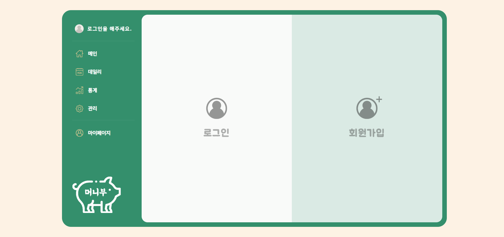
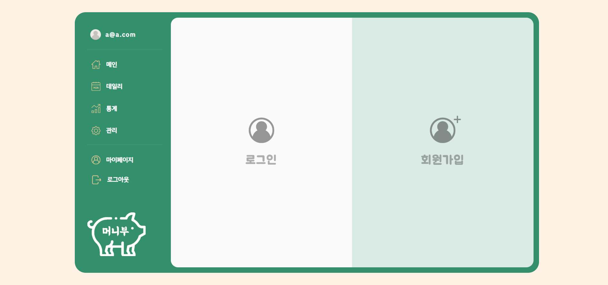
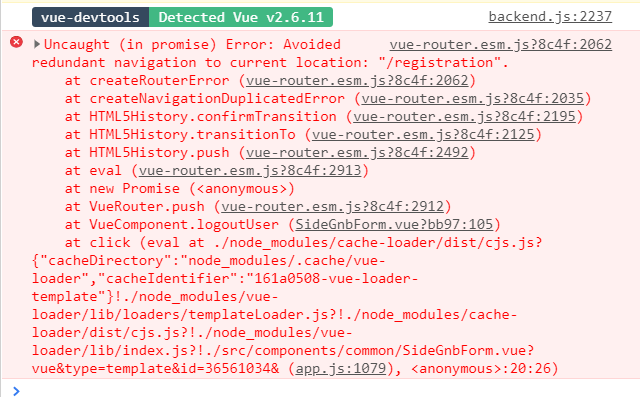

### 회원 인증 페이지 구현 
1. 프로젝트에서 ```data```를 새로고침 없이 바로바로 업데이트 해주기 위한 방법 연구
2. ```로그인 & 회원가입``` 페이지 구현을 위한 캡틴판교 강의 복습
3. **로그인한 유저 새로고침없이 다른 페이지에서 불러올 수 있도록 구현**
	- 캡틴판교 강의를 다시 복습하고 따라해보니 해결됐다
	> 기존에는 쿠키에 먼저 저장하고 유저 정보가 필요한 페이지에서 쿠키로 받아오도록 설정했는데, store 먼저 저장하고 저장된 data를 쿠키로 넘겨주는 방식으로 변경했더니 새로고침하지 않아도 유저가 바로 로드된다! 덤으로 쿠키에도 저장했으니 새로고침해도 유저정보가 사라지지 않는다!!
	```
	1. store에 로그인 정보 넘김
	2. cookie 저장
	```
4. ```store``` ```getters```에 유저의 로그인 상태를 계산하는 함수 생성
	```js
	getters: {
		isLogin(state) {
		// 빈문자열이 아니면 로그인 됐다라고 봄
			return  state.email  !==  '';
		},
	},
	```
	- 이를 이용해서 로그인 하기 전에는 로그아웃 버튼이 보이지 않게 하고 로그인을 했을때 비로소 로그아웃 버튼이 보이게끔 ux를 바꿨다.

	- 로그인 전

		

	- 로그인 후

		

	- 이제 로그아웃 기능만 구현하면 된다..
5. ```sideGnb``` css 수정
	- 상단에 로그인한 유저정보 업데이트
	- ```getters```의 ```isLogin()``` 함수를 이용해서 ux에 반영

6. 로그인/회원가입 애니메이션 
	- 로그인이 완료되면 reset해주는 애니메이션 함수를 만들어줬다.
	> 아직 애니메이션이 어색하다.. 좀 더 보완해야할 것 같다. 이 애니메이션해결하는게 제일 어려운 것 같다. 
	- **추가하고 싶은 기능**
		```
		1. 로딩바
		2. 로딩될때 배경 dimed 처리
		```
7. router 오류 연구 (이건 아래에 자세히 작성하겠음..)

#### vue 기능
- **```getters```**

	- 자연스럽게 state의 값이 변경되었을때 state의 상태를 계산할 수 있도록 함
	- [vuex-getters-mutations - 캡틴판교](https://joshua1988.github.io/web-development/vuejs/vuex-getters-mutations/)

- ```hot-reload```

	- [핫 리로드](https://vue-loader-v14.vuejs.org/kr/features/hot-reload.html)
	- [hot-reload](https://vue-loader.vuejs.org/guide/hot-reload.html)
- ```watch```
	- [Computed VS Watch 언제써야할까?](https://medium.com/@hozacho/%EB%A7%A8%EB%95%85%EC%97%90vuejs-computed-vs-watch-%EC%96%B8%EC%A0%9C%EC%8D%A8%EC%95%BC%ED%95%A0%EA%B9%8C-d25316c4ef42)

> 프로젝트에 필요할 수도 있으니 기능에 대한 연구도 했다. vue를 많이 알고있다고 생각했는데 아직 갈 길이 멀다.

#### 동적 라우팅 📌
- [vue-router에서 동적인 라우터 잘 사용하기](https://ashnamuh.netlify.app/posts/using-vue-dynamic-router-well/)
- [Vue.js Quick - Start vue-router를 이용한 라우팅](https://mkki.github.io/vue.js/2018/06/12/start-vuejs-12.html)
- [이름을 가지는 라우트](https://router.vuejs.org/kr/guide/essentials/named-routes.html)
- [중첩라우팅](https://www.daleseo.com/react-router-nested/)

#### ```firbase``` 로그인/회원가입 인증 관련 📌
- 공식 문서
	- [웹사이트에서 Firebase 인증 시작하기](https://firebase.google.com/docs/auth/web/start?hl=ko)
	- [firebase 로그인 관련 가이드](https://firebase.google.com/docs/auth/web/manage-users?authuser=0)

**- ```GoogleAuthProvider()```**
	- [초코몽키 firbase 사용자인증](https://wayhome25.github.io/firebase/2017/02/16/03_firebase_Authentication/)
		```js
		var provider = new firebase.auth.GoogleAuthProvider();
		```
	- 인증 제공 업체 개체의 인스턴스 생성 

		- ```firebase.auth().signInWithPopup(provider)```


#### router 에러 📌



- 현재 내 네비게이션 위치와 똑같은 위치를 로드시키도록 했을때 이러한 에러가 발생함

- 현재 위치로의 중복 탐색 방지라는 에러메세지
- error: Avoided redundant navigation to current location 검색
	- [NavigationDuplicated 현재 위치 (“/ search”)로 이동할 수 없습니다 [vuejs]](https://stackoverflow.com/questions/57837758/navigationduplicated-navigating-to-current-location-search-is-not-allowed)

	- [Vue에서 현재 위치 오류에 대한 중복 탐색을 피하는 방법은 무엇입니까?](https://stackoverflow.com/questions/62462276/how-to-solve-avoided-redundant-navigation-to-current-location-error-in-vue)
- 질문에서 찾은 코드를 적용


```js
his.$router.push(item.link).catch(err  => {
	// Ignore the vuex err regarding navigating to the page they are already on.
	if (
		err.name  !==  'NavigationDuplicated'  &&
		!err.message.includes(
			'Avoided redundant navigation to current location',
		)
	) {
		// But print any other errors to the console
		console.log(err);
	}
});
```

> 적용해봤으나 에러메세지만 안떴을뿐 디버깅이 생김

- 로그인 해결하고 천천히 적용시켜보자..

- [(Vue.js 오류 해결) 같은 경로일때 로드가 되지 않는 문제.](https://focuspro.tistory.com/7)


#### 캡틴판교 강의 북마크
- 브라우저 저장소를 이용한 인증 값 관리
	- actions 속성을 이용한 로그인 기능 구현과 비동기 처리시 유의할 점

- **```refresh```**
	- 학습 노트 데이터 삭제
		- 삭제 기능 UX 개선
	> 바로 바로 삭제해주는 기능에 대한 설명
	- [삭제기능 링크](https://www.inflearn.com/course/vue-js-%EB%81%9D%EB%82%B4%EA%B8%B0-%EC%BA%A1%ED%8B%B4%ED%8C%90%EA%B5%90/lecture/32126?tab=curriculum&speed=1.5)

#### ```async``` & ```await```
- 자바스크립트의 비동기처리 패턴 중  가장 최근에 나온 문법

- 기존의 비동기처리 방법인 콜백함수와 프로미스의 단점을 보완

- **async await의 기본 문법**
	```js
	async function 함수명() {
	  await 비동기_처리_메서드_명();
	}
	```
- 강의에서 나온 처리 방법 메모	
	```js
	async submitForm(){
	try{
			const { data } = await loginUser(userData)

			// store로 활용시
			await this.$store.dispatch('actions 함수명',userData)
		}
	}
	catch{
		console.log(error)
	}
	```
- [자바스크립트 async와 await](https://joshua1988.github.io/web-development/javascript/js-async-await/)


#### 앞으로 해결해야할 것
- 강의 마저 듣기
	- 수정 기능
		- user id 를 url에 params로 넘기는 작업
	- **네비게이션 가드**
- firebase api state로 넘기고 코드 모듈화
- router 에러 


#### 그밖의 참고 링크
- [Vue.js Jwt 인증 팁? 개인적인 정리](https://focuspro.tistory.com/14)


